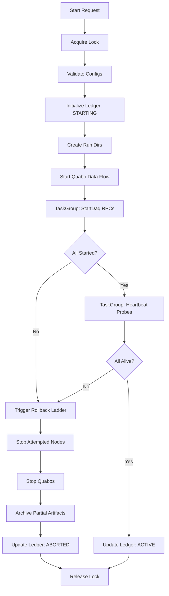
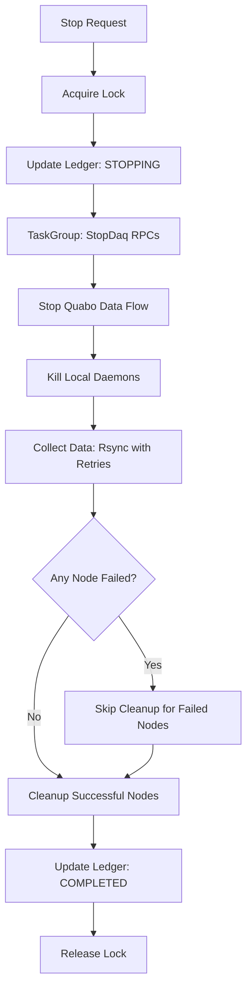
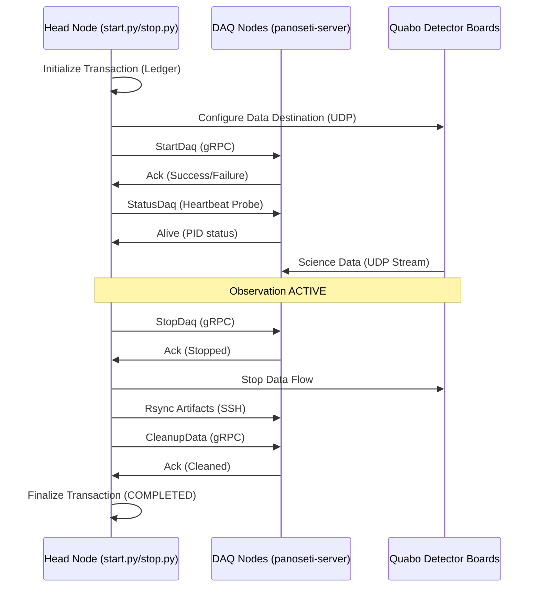

# Observing Run Transactions

This document describes the transactional integrity and rollback mechanisms implemented in the PANOSETI observatory control plane (`start.py` and `stop.py`).

## Overview

The observatory control plane manages a distributed system consisting of a head node, multiple DAQ nodes (running Hashpipe), and numerous Quabo detector boards. Starting or stopping an observation is a complex operation that must be handled atomically to avoid leaving the system in an inconsistent or "stuck" state.

## State Management & Locking

### Advisory Locking
To prevent concurrent or conflicting operations, all control processes must acquire an exclusive advisory lock on `tmp/panoseti_control.lock`. This ensures that only one `start.py`, `stop.py`, or `config.py` process is active at a time.

### Distributed Ledger
The system state is persisted in a TOML-based ledger located at `tmp/run_state.toml`. This ledger tracks the lifecycle of an observing run:
- **`STARTING`**: Initializing hardware and remote nodes.
- **`ACTIVE`**: Observation is currently running and recording.
- **`STOPPING`**: Graceful shutdown and data collection in progress.
- **`COMPLETED`**: Run finished successfully; all data centralized.
- **`ABORTED`**: Run failed during startup or was manually cancelled; rollback performed.

The ledger also contains **Node Receipts**, which track the status of each remote DAQ node (e.g., Hashpipe PID, local data directory).

---

## Start Transaction (`start.py`)

The startup sequence is handled as a single transaction with a "Rollback Ladder" for error recovery. It leverages **`asyncio.TaskGroup`** for fail-fast concurrency.

### 1. Pre-flight Checks
- Acquire advisory lock.
- Validate all configuration files.
- Ensure no other run is active in the ledger (or archive stale ledgers).

### 2. Initialization
- Record `STARTING` state in the ledger.
- Create local run directories on the head node.
- **Start Data Flow**: Configure Quabos to point their UDP streams to the assigned DAQ nodes.

### 3. Execution (Fail-Fast Concurrency)
- **Start DAQ**: Concurrent gRPC calls to all DAQ nodes. A node receipt is written to the ledger *immediately before* each RPC to ensure the rollback ladder knows which nodes were attempted.
- **Liveness Probe**: A retry heartbeat loop (5 attempts with 1s backoff) verifies that the Hashpipe process is alive and healthy on all nodes.
- **Persistence**: Update ledger to `ACTIVE`.

### 4. Rollback Ladder
If any step in the TaskGroup fails (e.g. one node times out), all pending tasks are cancelled and a rollback is triggered:
1. **Stop remote DAQs**: Signal remote Hashpipe processes to exit on all nodes that have a receipt in the ledger.
2. **Stop Quabo flow**: Send zeroed parameters to all Quabos to halt data transmission.
3. **Kill local daemons**: Terminate HK/HV monitoring processes.
4. **Archive artifacts**: Move partial run data to `_aborted/` with a failure context dump.
5. **Update Ledger**: Mark as `ABORTED`.

### Start Flow Chart

---

## Stop Transaction (`stop.py`)

The shutdown sequence prioritizes resilience, best-effort cleanup, and data preservation.

### 1. Resilient Shutdown
- Acquire advisory lock.
- **Stop Recording**: Concurrent gRPC calls to stop remote Hashpipes. 
- **Stop Interleave**: Gracefully stop the interleave daemon with SIGTERM/SIGKILL escalation.
- **MAROC Restoration**: Restore Quabo registers to safe defaults.

### 2. Data Collection (Transactional Collection)
- Point ledger to `STOPPING`.
- **Collect Data**: Rsync PFF artifacts from DAQ nodes to the head node.
- **Transient Retry**: Retries on network/SSH errors (codes 12, 23, 30, 35, 255) with exponential backoff.
- **Node-Aware Tracking**: Identifies specific IPs that failed collection after retries are exhausted.

### 3. Selective Cleanup
- **Safe Cleanup**: Call `CleanupData` gRPC ONLY for nodes where collection was verified successful.
- **Data Preservation**: Nodes that failed collection are skipped during cleanup to prevent data loss.
- Release the lock and mark state as `COMPLETED`.

### Stop Flow Chart

---

## Network Transaction Flow

The interaction between the head node, DAQ fleet, and detector hardware:

