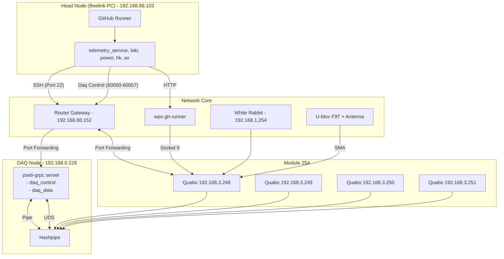

# PANOSETI Hardware-Software (HW-SW) HITL Testing

This document describes the Hardware-in-the-Loop (HITL) testing infrastructure for PANOSETI. These tests bridge the gap between pure simulations and production deployments by orchestrating real hardware components across a physical network.

## 🌌 HW-SW System Topology

The HITL environment consists of a physical head node, a dedicated router, a DAQ node, and a module containing 4 physical Quabos.



## 🛠️ Deployment Strategy: Compose-over-SSH

We use Docker/Podman Compose `profiles` and the SSH transport to maintain physical network realism without the complexity of Docker Swarm.

- **Headnode Profile:** Deployed locally on the head node.
- **DAQnode Profile:** Deployed to the remote DAQ node via SSH.

### Container Engine Support
The HITL infrastructure supports both **Podman** (default) and **Docker**.
- When using Podman, the remote connection uses the `CONTAINER_HOST` environment variable.
- When using Docker, the remote connection uses the `DOCKER_HOST` environment variable.

### Zero-Overhead UDP Capture
The DAQ node container uses `network_mode: "host"`. This ensures the Hashpipe process has direct access to the physical NIC, bypassing the virtual bridge and guaranteeing zero-overhead capture of high-bandwidth UDP streams from the Quabos.

## 🚀 CLI Usage

The `pseti` CLI provides the `hw-test` top-level command group for orchestration.

### Configuration
By default, `pseti test hw` uses **Podman**. To switch to Docker, use the `--tool` option:
```bash
pseti test hw --tool docker build
```

### 1. Build Images
Build the local images required for the test stack.
```bash
pseti test hw build
```

### 2. Check Environment
Verify that the environment is ready and there is sufficient disk space (default 10GB) on the SSD mount.
```bash
pseti test hw check-env --min-gb 20
```

### 3. Deploy Stack
Initialize containers on both the local head node and the remote DAQ node.
```bash
pseti test hw deploy
```

### 4. Run Tests
Execute the HW-SW test suite.
```bash
pseti test hw run
```

### 5. Cleanup
Tear down the stack and wipe the physical data directory to prevent disk exhaustion.
```bash
pseti test hw clean
```

## 📁 Configuration Details

Gold-standard configurations for the HITL environment are located in `control/src/ci/hardware-software/configs/`.

- `obs_config.json`: Defines the 4-Quabo module and site coordinates.
- `network_config.json`: Maps the router and port-forwarding rules.
- `daq_config.json`: Configures `/mnt/panoseti-test/` as the primary SSD storage path.
- `firmware.json` & `quabo_uids.json`: Hardware-level metadata for the physical Quabos.

## 🧪 Safety & Stability

- **Disk Exhaustion:** Always run `pseti test hw clean` after a run. It explicitly executes `rm -rf` on both local and remote data directories.
- **Network Isolation:** The DAQ node is isolated behind the router; all communication from the head node goes through the specified `gw_ip`.
- **No-HV:** All HW-SW tests should be initialized with the `--no_hv` flag (handled by the test runner) to protect the physical detectors during automated testing.
