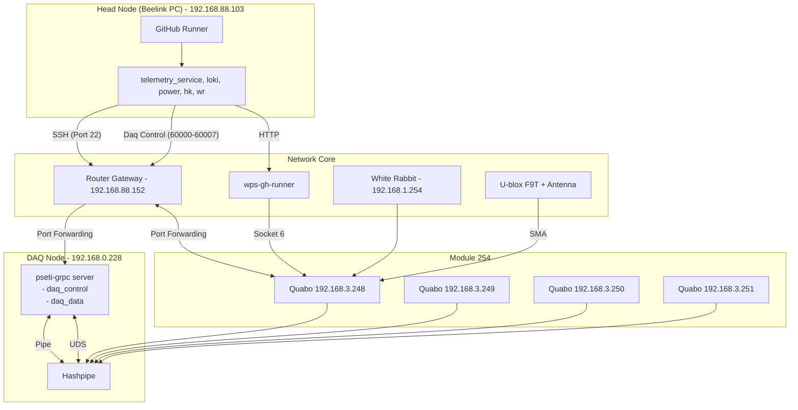
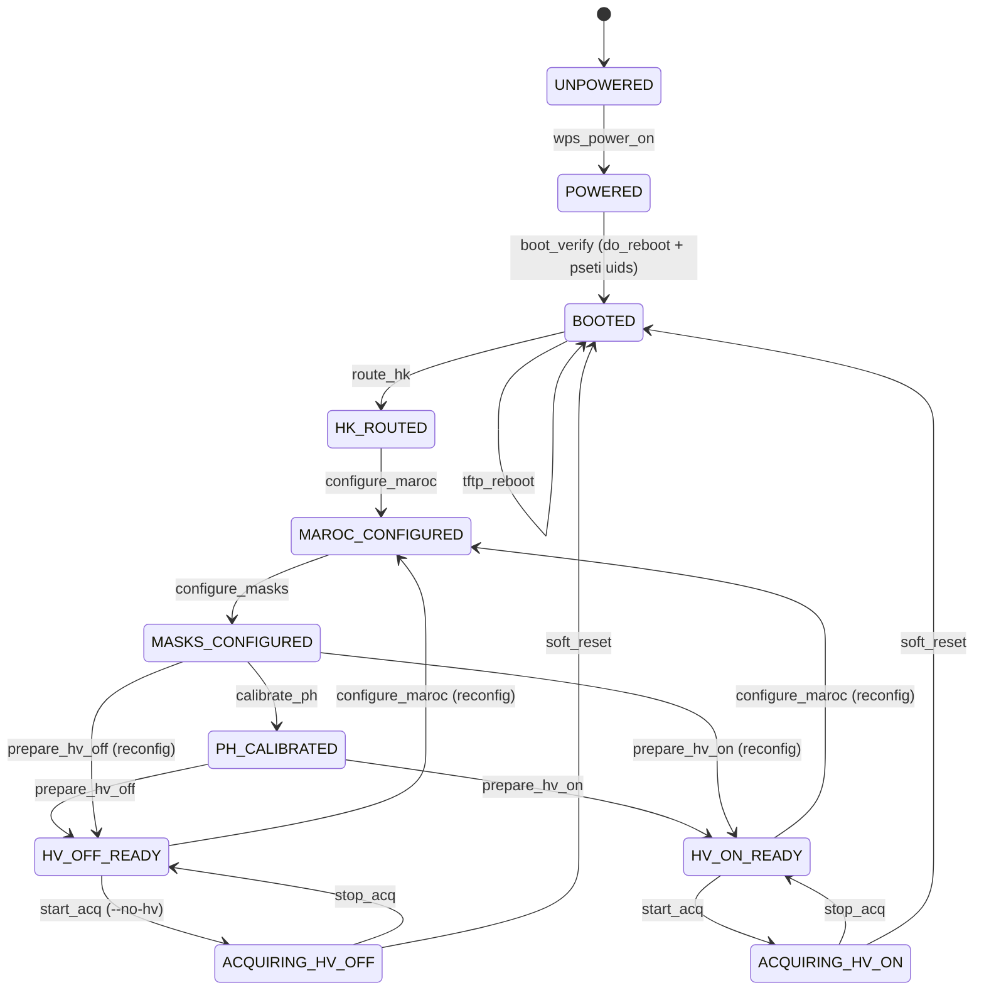

# PANOSETI Hardware-Software (HW-SW) HITL Testing

This document describes the Hardware-in-the-Loop (HITL) testing infrastructure for PANOSETI. These tests bridge the gap between pure simulations and production deployments by orchestrating real hardware components across a physical network.

## 🌌 HW-SW System Topology

The HITL environment consists of a physical head node, a dedicated router, a DAQ node, and a module containing 4 physical Quabos.



## 🛠️ Deployment Strategy: Compose-over-SSH

We use Docker/Podman Compose `profiles` and the SSH transport to maintain physical network realism without the complexity of Docker Swarm.

- **Headnode Profile:** Deployed locally on the head node.
- **DAQnode Profile:** Deployed to the remote DAQ node via SSH.

### Container Engine Support
The HITL infrastructure supports both **Podman** (default) and **Docker**.
- When using Podman, the remote connection uses the `CONTAINER_HOST` environment variable.
- When using Docker, the remote connection uses the `DOCKER_HOST` environment variable.

### Zero-Overhead UDP Capture
The DAQ node container uses `network_mode: "host"`. This ensures the Hashpipe process has direct access to the physical NIC, bypassing the virtual bridge and guaranteeing zero-overhead capture of high-bandwidth UDP streams from the Quabos.

## 🚀 CLI Usage

The `pseti` CLI provides the `hw-test` top-level command group for orchestration.

### Configuration
By default, `pseti test hw` uses **Podman**. To switch to Docker, use the `--tool` option:
```bash
pseti test hw --tool docker build
```

### 1. Build Images
Build the local images required for the test stack.
```bash
pseti test hw build
```

### 2. Check Environment
Verify that the environment is ready and there is sufficient disk space (default 10GB) on the SSD mount.
```bash
pseti test hw check-env --min-gb 20
```

### 3. Deploy Stack
Initialize containers on both the local head node and the remote DAQ node.
```bash
pseti test hw deploy
```

### 4. Run Tests
Execute the HW-SW test suite. The framework uses a state machine to automatically transition hardware to the required state before each batch.
```bash
pseti test hw run
```

#### State Machine & Boot Semantics

**Golden Path Principle:** The HITL state machine is a direct mirror of the `pseti session-start` production boot sequence. Every primitive in the state machine must delegate to the same `control.config` function that `session-start` uses — never re-implement hardware control logic in `driver_ops.py`. This guarantees that the test harness exercises exactly the same code path as production.

The `pseti session-start` sequence is:
1. `pseti power on` → WPS outlet on
2. `pseti uids` → TFTP-fetch hardware UIDs from each quabo (Q0→Q1→Q2→Q3 within module, parallel across modules), save to `tmp/quabo_uids.json`
3. `pseti reboot` → TFTP reboot in the same Q0→Q1→Q2→Q3 order, wait for each quabo to ping-respond before moving to next
4. `pseti cfg hk-dest` → Route housekeeping packets to head node
5. `pseti cfg maroc` → Program MAROC registers (uses per-quabo calibration from `quabo_info.json`, keyed by UID — requires UIDs to be discovered first)
6. `pseti cfg masks` → Write trigger masks and GOE masks
7. `pseti cfg calibrate-ph` → Run PH baseline calibration

**Critical ordering constraints:**
- Quabos within a module must be rebooted Q0→Q1→Q2→Q3 (Q0 sets the timing reference)
- UIDs must be discovered (step 2) before MAROC configuration (step 5), because `do_maroc_config` looks up per-quabo calibration data by UID
- `quabo_info.json` must contain a `"default"` entry for any UID not explicitly listed; missing UIDs will cause an interactive prompt that blocks non-interactive runs

The HITL framework uses a state machine to automatically transition hardware to the required state before each test batch:



**Key Features of the State Machine:**
- **Golden Path Delegation**: Each primitive in `driver_ops.py` calls the corresponding `control.config.do_*` function used by `session-start`. Never re-implement hardware logic.
- **Robust Booting (`boot_verify`)**: Delegates to `config.do_reboot` which handles Q0→Q1→Q2→Q3 ordering. Followed by `pseti uids` to cache hardware UIDs before later steps need them.
- **Granular Initialization**: Explicitly models `HK_ROUTED`, `MAROC_CONFIGURED`, and `MASKS_CONFIGURED` to allow tests to target exact configuration phases.
- **Optional HV Paths**: The graph branches after `PH_CALIBRATED`. Tests can require `HV_OFF_READY` (using a pulse generator) or `HV_ON_READY` (using physical detectors).
- **Cyclic Reconfiguration**: Supports the "interleaved" observing mode natively. The system can loop back from a `READY` state to `MAROC_CONFIGURED` and back to `READY` without dropping High Voltage or requiring recalibration.

#### Telemetry Co-existence
To allow test sockets and the `capture_hk.py` daemon to receive the same UDP/60002 packets, both must set the `SO_REUSEPORT` and `SO_REUSEADDR` socket options. The `hk_socket` fixture and `capture_hk.py` are both patched to support this cooperative binding.

#### Test Markers & Timeouts
- **`@pytest.mark.timeout(N)`**: Used to override the global default for long-running hardware operations (booting, high-voltage ramping, data transfers).
- **`@pytest.mark.slow_hw`**: Marks tests that take >60 seconds. You can run a fast subset with `pytest -m "not slow_hw"`.

### 5. Cleanup
Tear down the stack and wipe the physical data directory to prevent disk exhaustion.
```bash
pseti test hw clean
```

## 📁 Configuration Details

Gold-standard configurations for the HITL environment are located in `control/src/ci/hardware_software/configs/`.

- `obs_config.json`: Defines the 4-Quabo module and site coordinates.
- `network_config.json`: Maps the router and port-forwarding rules.
- `daq_config.json`: Configures `/mnt/panoseti-test/` as the primary SSD storage path.
- `firmware.json` & `quabo_uids.json`: Hardware-level metadata for the physical Quabos.

## 🧪 Safety & Stability

- **Disk Exhaustion:** Always run `pseti test hw clean` after a run. It explicitly executes `rm -rf` on both local and remote data directories.
- **Network Isolation:** The DAQ node is isolated behind the router; all communication from the head node goes through the specified `gw_ip`.
- **No-HV:** All HW-SW tests should be initialized with the `--no_hv` flag (handled by the test runner) to protect the physical detectors during automated testing.

## 🔗 Shared Helpers with software_only_v2

Some assertion helpers from the software_only_v2 CI tree are useful in HITL tests:

- **`StateProbe`** (`ci/software_only_v2/infra/workspace.py`): wraps ledger status assertions (`assert_ledger_status`, `current_run_name`, `any_pff_files`) and manifest verification over `PanoPaths`. Import directly if you want to assert post-run state without re-implementing ledger parsing.
- **gRPC client builders** (`ci/software_only_v2/fixtures/fleet.py`): `daq_control_client(idx)` / `daq_data_client(idx)` construct typed gRPC clients given a host/port. Useful for in-process gRPC assertions against a live `pseti-grpc server` on the DAQ node.

Note: HITL deliberately does **not** isolate `PSETI_*` env vars (it reads real configs), so `pseti_workspace`, `FleetSpec`, and the testcontainer orchestration from v2 are not applicable here.
