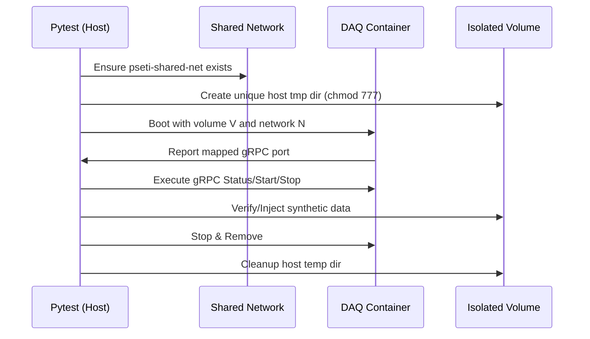
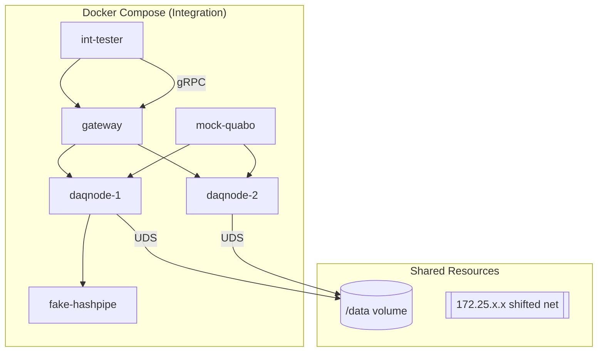

# PANOSETI Control — CI Test Suite

The PANOSETI control plane uses a **5-Tier Tiered Testing Architecture** to balance speed, isolation, and high-fidelity simulation. All tests live under `control/src/ci/`.

---

## 📋 Test Hierarchy

| Tier | Directory | Purpose | Infrastructure |
|---|---|---|---|
| **Tier 1 (Unit)** | `ci/tier1_unit/` | Pure logic, parsing, and math. | Native (Parallel) |
| **Tier 2 (Logic)** | `ci/tier2_logic/` | Subsystem logic with mocked gRPC. | Native + Isolated State |
| **Tier 3 (Fleet)** | `ci/tier3_fleet/` | Distributed flows with dynamic nodes. | `testcontainers` + Mocks |
| **Tier 4 (Chaos)** | `ci/tier4_chaos/` | Fault injection & resilience tests. | `testcontainers` + Failure Injection |
| **Tier 5 (Integration)** | `ci/tier5_integration/` | Heavy realistic SW simulation with tcpreplay -> Hashpipe and panoseti gRPC. | Static Docker Compose |

---

## 🚀 Quick Start

The PANOSETI QA runner (`pseti test`) manages isolated environments for different suites.

```bash
# 1. Standard commands
pseti test sw unit         # Tier 1: Fast unit tests
pseti test sw logic        # Tier 2: State logic tests
pseti test sw fleet        # Tier 3: Multi-node dynamic tests
pseti test sw chaos        # Tier 4: Distributed resilience
pseti test sw integration  # Tier 5: Heavy stack (Hashpipe/PCAP)
pseti test lint            # Ruff & MyPy verification

# 2. Comprehensive run
pseti test sw all          # Run Tiers 1 through 5 sequentially
```

---

## 🛠️ Key Fixtures & Utilities

### `auto_isolate` (The Split-Brain Pattern)
Every test uses the `auto_isolate` fixture to redirect `PSETI_STATE`, `PSETI_CONFIG`, and `PSETI_LOGS` to a unique `tmp_path`. 
*   **Host Perspective:** Tests prepare mock data in the isolated `tmp_path`.
*   **Container Perspective:** Fleet containers mount these paths and see them as `/data`.

### `session_fleet` (Dynamic Orchestration)
Tiers 3 and 4 use `testcontainers` to spin up a dynamic fleet of DAQ nodes.
*   **Shared Backbone:** All nodes attach to a persistent `pseti-shared-net` to avoid subnet exhaustion.
*   **Isolated Volumes:** Every container is assigned a unique host directory for its `/data` volume to prevent parallel state collisions.
*   **Session-Aware IDs:** Module IDs are dynamically calculated from the assigned session IP prefix (`ip_addr_to_module_id`). This ensures mathematical consistency with PANOSETI validation rules even when prefixes are shifted for parallel workers.

### Reliability & Timeouts
*   **Robust Teardown:** All tests utilize a global cleanup fixture that performs a tiered termination (SIGINT -> wait -> SIGKILL) of remote processes.
*   **Extended Timeouts:** Integration tests (`pytest-timeout`) are configured for **120 seconds** to accommodate the hardware-mandated 60-second graceful buffer flush period during `StopDaq`.

### `daq_control_direct` / `daq_data_client`
Standard gRPC clients connected to the first node in the current test's fleet (via dynamic port mapping).

---

## 🏗️ Architecture Diagrams

### Testcontainer Lifecycle (Tier 3/4)


### Heavy Integration Stack (Tier 5)
Tier 5 uses a **static** Docker Compose stack because real software (Hashpipe) requires shared memory, network capabilities, and PCAP replay that are too "heavy" for ephemeral containers.



---

## 💡 Adding New Tests

1.  **Which Tier?**
    *   Can you test it with just a function call? → **Tier 1**.
    *   Does it involve the `TransferQueue` or ledger transitions? → **Tier 2**.
    *   Does it require real gRPC servers communicating between nodes? → **Tier 3**.
    *   Are you testing how the system handles a killed process or timeout? → **Tier 4**.
    *   Does it require a real `hashpipe.so` binary or `tcpreplay`? → **Tier 5**.

2.  **Volume Boundaries:** Remember the **Permission Paradox**. Containers run as `root`. Host-side test code MUST call `os.chmod(path, 0o777)` recursively on any directories it creates for containers to use.

3.  **Subnet Shifting:** If you add a new static environment, use `qa.toml` to shift subnets (e.g., to the `50` block) to ensure it never collides with the persistent Tier 3 backbone.
