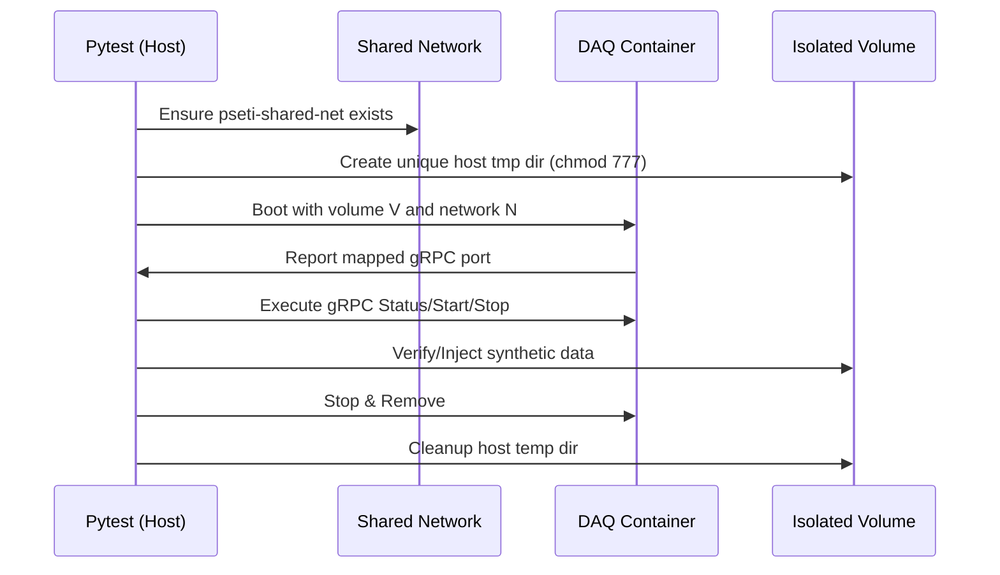
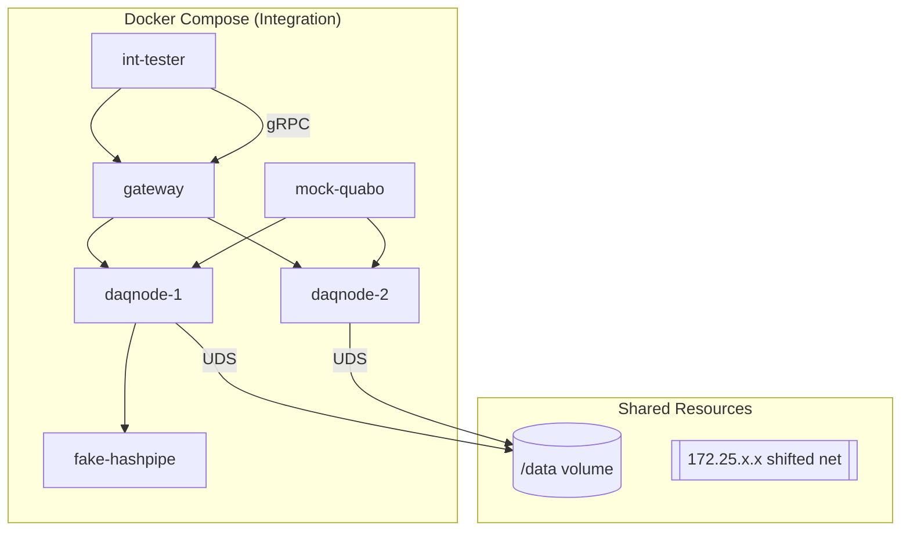

# PANOSETI Control — CI Test Suite

The PANOSETI control plane uses a **5-Tier Tiered Testing Architecture** to balance speed, isolation, and high-fidelity simulation. All tests live under `control/src/ci/`.

---

## 📋 Test Hierarchy

The current test tree lives at `ci/software_only_v2/` (v2). A v1 tree at `ci/software_only/` is being sunset — see [SUNSET.md](software_only_v2/SUNSET.md) for the deletion timeline.

| Tier | v2 Directory | Purpose | Infrastructure |
|---|---|---|---|
| **Tier 1 (Unit)** | `src/ci/software_only_v2/tier1_unit/` | Pure logic, parsing, and math. | Native (Parallel) |
| **Tier 2 (Logic)** | `src/ci/software_only_v2/tier2_logic/` | Subsystem logic with isolated workspace. | Native + Isolated State |
| **Tier 3 (Fleet)** | `src/ci/software_only_v2/tier3_fleet/` | Distributed flows with dynamic nodes. | `testcontainers` (no persistent service) |
| **Tier 4 (Chaos)** | `src/ci/software_only_v2/tier4_chaos/` | Fault injection & resilience tests. | `testcontainers` + Failure Injection |
| **Tier 5 (Integration)** | `src/ci/software_only_v2/tier5_integration/` | Heavy realistic SW simulation with tcpreplay → Hashpipe and panoseti gRPC. | Static Docker Compose |

---

## 🚀 Quick Start

The PANOSETI QA runner (`pseti test`) manages isolated environments for different suites.

```bash
# 1. Standard commands (v2 — current)
pseti test sw2 unit         # Tier 1: Fast unit tests
pseti test sw2 logic        # Tier 2: State logic tests
pseti test sw2 fleet        # Tier 3: Multi-node dynamic tests
pseti test sw2 chaos        # Tier 4: Distributed resilience
pseti test sw2 integration  # Tier 5: Heavy stack (Hashpipe/PCAP)
pseti test lint             # Ruff & MyPy verification

# 2. Comprehensive run
pseti test sw2 all          # Run Tiers 1 through 5 sequentially
```

---

## 🛠️ Key Fixtures & Utilities (v2)

### `pseti_workspace` — Isolated environment
Every test that touches configs uses `pseti_workspace` (function-scoped) to redirect all `PSETI_*` env vars to a unique `tmp_path` and write all 7 config files from a `FleetSpec`. `GlobalConfigValidator.validate_all()` runs at fixture setup — no raw-dict configs, no bypassed validators.

```python
@pytest.mark.parametrize("pseti_workspace", [FleetSpec.minimal_fleet()], indirect=True)
def test_something(pseti_workspace):
    assert pseti_workspace.topology.daq_config.daq_nodes[0].node_ip == "..."
```

### `session_fleet` — Dynamic testcontainers fleet (Tier 3/4)
Module-scoped fixture. Boots a `Fleet` of `HeadnodeContainer` + N×`DaqNodeSimContainer` from a `FleetSpec`, waits for gRPC health, yields the `Fleet` handle, then tears down.

```python
def test_two_node(session_fleet: Fleet) -> None:
    client = session_fleet.daq_control_client(0)
    resp = client.StatusDaq({"data_dir": "/data", "check_hashpipe_running": True, ...})
```

### `chaos` — Fault injection accessor (Tier 4)
```python
def test_kill_server(chaos_fleet: Fleet) -> None:
    node = chaos_fleet.daq_nodes[0]
    with chaos_fleet.chaos.proc.kill_after(node, "pseti-grpc", delay_s=1.0):
        ...
    assert chaos_fleet.chaos.proc.wait_alive(node, "pseti-grpc", timeout=30)
```
Sub-handles: `chaos.net` (tc-netem), `chaos.iptables`, `chaos.disk`, `chaos.proc`, `chaos.grpc`.

### `FleetSpec` DSL — Declarative topology
```python
spec = (
    FleetSpec(seed=42)
        .with_headnode(ip="10.0.1.5")
        .add_module(id=200, version="qfp", timing="wr", ip="192.168.3.32")
        .add_daq_node(ip="192.168.0.10", modules=[200])
        .build()
)
```

### v1 fixture equivalents
| v1 | v2 |
|---|---|
| `auto_isolate` | `pseti_workspace` |
| `session_fleet` (v1) | `session_fleet` (v2 module-scoped) |
| `daq_control_direct` / `daq_data_client` | `fleet.daq_control_client(idx)` / `fleet.daq_data_client(idx)` |
| `chaos_headnode_workspace` | `pseti_workspace` + `FleetSpec.minimal_fleet()` |
| `make_mock_daq_config` | `FleetSpec.build().topology.daq_config` |

### Reliability & Timeouts
*   **Robust Teardown:** All tests utilize a global cleanup fixture that performs a tiered termination (SIGINT → wait → SIGKILL) of remote processes.
*   **Extended Timeouts:** Integration tests (`pytest-timeout`) are configured for **120 seconds** to accommodate the hardware-mandated 60-second graceful buffer flush period during `StopDaq`.

## 🔐 Docker Permissions & UID Injection

To ensure frictionless development and CI, PANOSETI uses **Build-Time UID Injection**. This strategy aligns the container user with your host user, eliminating the "Permission Denied" errors common with host-mounted volumes.

### How it works
1.  **Build Phase:** When you run `pseti test build`, the runner detects your host `UID` and `GID` (e.g., `1001:1001`) and passes them as `--build-arg` to Docker.
2.  **User Creation:** The `Dockerfile.ci` creates a internal `panoseti` user with these exact numeric IDs.
3.  **Native Access:** Because the container user matches the host user, any directory you mount (like `control/` or `/mnt/panoseti-test/`) is natively readable and writable by the container without needing `root` or `chmod -R` hacks.

### Key Rules
*   **Avoid Runtime Remapping:** Do not use `gosu` or `usermod` in new entrypoint scripts. Rely on the image being built for the correct user.
*   **Multi-Node Consistency:** In the physical lab (HITL), images **must be rebuilt** on the specific node if the host UID differs from the development machine. Use `pseti test hw build` to trigger coordinated builds across all nodes.
*   **Shared Volumes:** For anonymous volumes (like `/data` in Tier 5), the entrypoint automatically handles ownership alignment if it detects it is running as root (e.g., in specialized system containers).

### Troubleshooting
If you see `Permission denied` inside a container:
1.  Verify your host UID: `id -u`.
2.  Check the container UID: `docker exec <id> id -u`.
3.  If they mismatch, rebuild: `pseti test build`.

---

## 🏗️ Architecture Diagrams

### Testcontainer Lifecycle (Tier 3/4)


### Heavy Integration Stack (Tier 5)
Tier 5 uses a **static** Docker Compose stack because real software (Hashpipe) requires shared memory, network capabilities, and PCAP replay that are too "heavy" for ephemeral containers.



---

## 💡 Adding New Tests

1.  **Which Tier?**
    *   Can you test it with just a function call? → **Tier 1** (`tier1_unit/`).
    *   Does it involve the `TransferQueue` or ledger transitions? → **Tier 2** (`tier2_logic/`).
    *   Does it require real gRPC servers communicating between nodes? → **Tier 3** (`tier3_fleet/`).
    *   Are you testing how the system handles a killed process or timeout? → **Tier 4** (`tier4_chaos/`).
    *   Does it require a real `hashpipe.so` binary or `tcpreplay`? → **Tier 5** (`tier5_integration/`).

2.  **Always add tests to v2** (`ci/software_only_v2/`), not v1 (`ci/software_only/`). The v1 tree is in sunset.

3.  **Volume Boundaries:** When a container writes to a bind-mounted directory, create it with `os.chmod(path, 0o777)` first so the container (which runs as its own user) can write to it.

4.  **Subnet Shifting:** If you add a new static environment, use `qa.toml` to shift subnets (e.g., to the `50` block) to ensure it never collides with the testcontainers Tier 3/4 network.

---

## 🌅 v1 → v2 Sunset

v1 (`ci/software_only/`) and v2 (`ci/software_only_v2/`) run in parallel in CI during a 7-day soak period. Once every v1 test has a passing v2 parity counterpart and the soak is clean, v1 is deleted.

See [`ci/software_only_v2/SUNSET.md`](software_only_v2/SUNSET.md) for the deletion checklist and sunset gate rules.
