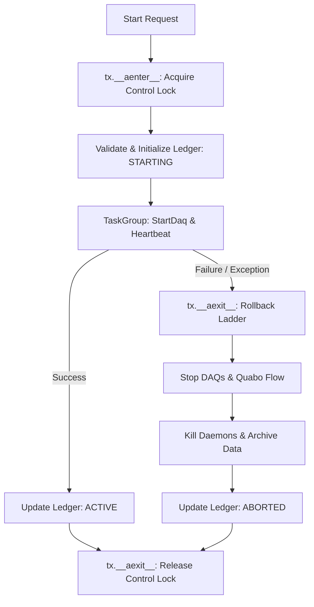
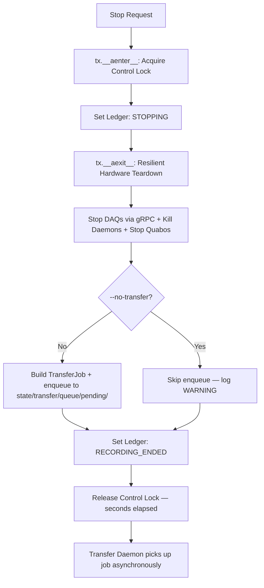
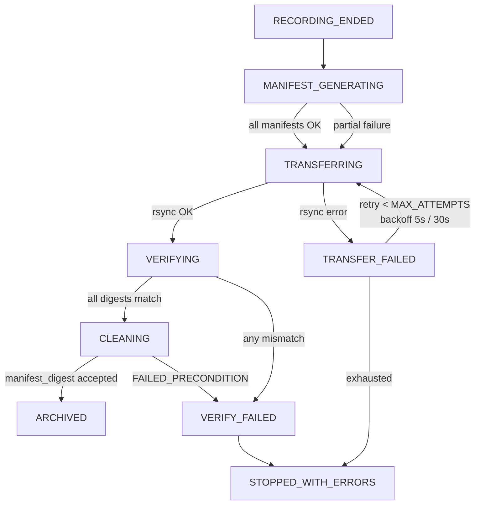
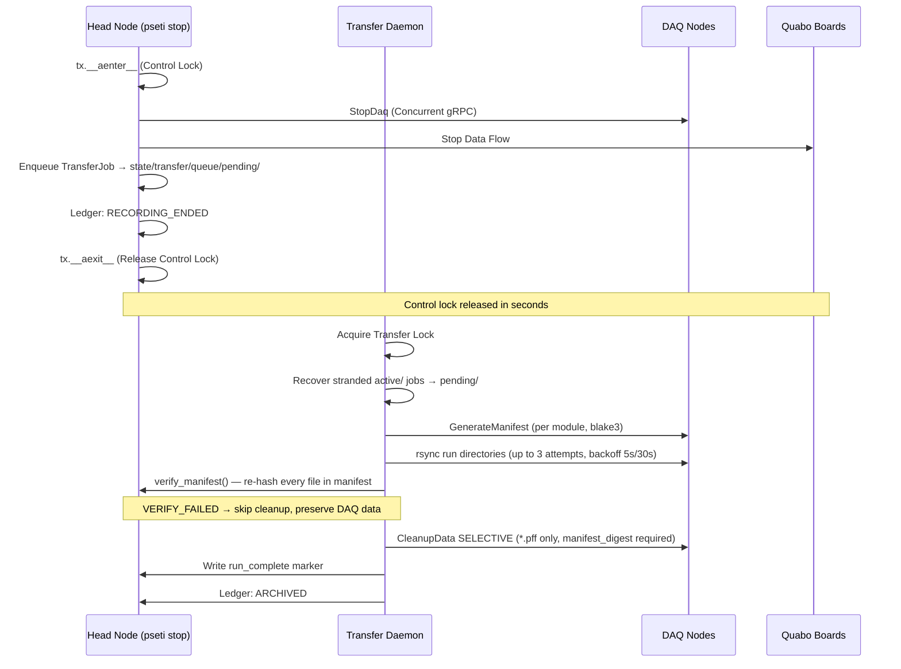

# Observing Run Transactions

This document describes the transactional integrity and rollback mechanisms implemented in the PANOSETI observatory control plane (`pseti start` and `pseti stop`) using the **Context Manager Architecture**, and the decoupled Transfer Daemon that owns all bulk I/O.

## Overview

The observatory control plane manages a distributed system (Head node, DAQ nodes, Quabo detectors). Starting or stopping an observation is handled atomically by `StartTransaction` and `StopTransaction` context managers — implemented in `control/src/control/start.py` (class `StartTransaction`, line ~77) and `control/src/control/stop.py` (class `StopTransaction`, line ~62) respectively. Since the `pseti stop` refactor, bulk data transfer (rsync, manifest generation, selective cleanup) is decoupled from the advisory lock and executed by the Transfer Daemon (`control/src/control/transfer/daemon.py`).

## State Management & Locking

### Advisory Lock Hierarchy

Two separate advisory locks prevent concurrent operations at different granularities:

| Lock file | Mechanism | Held by | Duration |
|---|---|---|---|
| `state/locks/panoseti_control.lock` | `os.O_EXCL` + stale-PID healing | `pseti start` / `pseti stop` | Seconds (hardware I/O only) |
| `state/locks/panoseti_transfer.lock` | `fcntl.LOCK_EX \| LOCK_NB` | Transfer Daemon | Full job duration (minutes to hours) |

The control lock uses atomic file creation (`O_CREAT | O_EXCL`). If acquisition fails, the PID inside the file is checked — a dead PID causes a self-healing delete and retry (SC-015/SC-021). The transfer lock uses `flock`, which the kernel releases automatically on process exit.

## High-Performance Orchestration

Starting with Phase 4 of the architectural modernization, the control plane uses native asynchronous gRPC for all distributed operations:

- **Async-Native gRPC**: Utilizes `AsyncDaqControlClient` (built on `grpc.aio`) for non-blocking coordination of the DAQ fleet.
- **Strict Parameter Validation**: All gRPC requests are validated client-side via dedicated Pydantic `client_models.py` before hitting the network.
- **Concurrent Execution**: Multi-node operations (Start/Stop/Status) are executed in parallel using `asyncio.TaskGroup`, ensuring the head node can scale to large observatory topologies without thread-pool bottlenecks.
- **Authoritative Resolution**: `util.get_quabo_ip_port()` is the single source of truth for resolving effective Quabo addresses, correctly handling Gateway port forwarding for both TCP (gRPC) and UDP (Command) traffic.

### Distributed Ledger

The system state is persisted in a TOML-based ledger (`state/runs/ledger.toml`).

**Full status vocabulary:**

| Status | Owner | Meaning |
|---|---|---|
| `STARTING` | pseti start | Hardware bring-up in progress |
| `ACTIVE` | pseti start | Observation recording |
| `ABORTED` | pseti start | Rollback completed after startup failure |
| `STOPPING` | pseti stop | Hardware teardown in progress |
| `RECORDING_ENDED` | pseti stop | Hardware stopped; transfer job enqueued |
| `MANIFEST_GENERATING` | daemon | DAQ nodes computing checksums |
| `MANIFEST_READY` | daemon | All manifests generated |
| `TRANSFER_PENDING` | daemon | Awaiting rsync start |
| `TRANSFERRING` | daemon | rsync in progress; `transfer_attempts` mirrored to ledger |
| `TRANSFER_FAILED` | daemon | rsync failed; `last_transfer_error` mirrored to ledger |
| `VERIFYING` | daemon | Checking transferred files |
| `VERIFY_FAILED` | daemon | Digest mismatch detected; mirrored to ledger |
| `CLEANUP_PENDING` | daemon | Awaiting selective cleanup |
| `CLEANING` | daemon | Removing .pff files from DAQ nodes |
| `ARCHIVED` | daemon | run_complete marker written |
| `COMPLETED` | (legacy) | Synonymous with ARCHIVED in old code |
| `STOPPED_WITH_ERRORS` | daemon | Archive complete but with errors |

**Node receipts** (`NodeReceipt` in `pydantic_config_models.py`) track per-DAQ-node state including `manifest_path`, `manifest_bytes`, `rsync_bytes_transferred`, `rsync_last_progress_at`, `verify_ok`, and `cleanup_ok`.

### Ledger Mirroring

The Transfer Daemon maintains "Ledger Truth" by mirroring its internal state onto the central run ledger. Every time a transfer attempt is incremented or an error is encountered, the daemon calls `state_mgr.transition()` to update the ledger's `transfer_attempts` and `last_transfer_error` fields. This allows operators to inspect the ledger at any time (e.g., via `pseti obs ledger`) to understand why a transfer is retrying or has failed.

---

## Start Transaction (`StartTransaction`)

Managed via `async with StartTransaction(...) as tx:`.

### 1. `__aenter__`
- Acquires the control advisory lock.
- Returns the transaction context.

### 2. Execution Phase (in `start_run`)
- **Pre-flight**: Validates configs, checks Quabo reachability.
- **Initialize**: Writes `STARTING` status and node receipts.
- **Start**: Launches local daemons, concurrent `StartDaq` RPCs, and heartbeat probes.

### 3. `__aexit__` (Rollback Ladder)
If an exception occurs (e.g., node timeout), `__aexit__` triggers the rollback:
1. **Stop Attempted DAQs**: Concurrent `StopDaq` for nodes with receipts.
2. **Stop Quabo Flow**: Halt data transmission.
3. **Kill Local Daemons**: Cleanup HK/HV/Temp processes.
4. **Archive artifacts**: Move partial run data to `_aborted/` with a context dump.
5. **Update Ledger**: Mark as `ABORTED`.
6. **Release Lock**.

### Start Flow Diagram


---

## Pre-flight Checks & Strictness Mode

`pseti start` runs a series of pre-flight checks before issuing any hardware commands.  Whether a failing check aborts the transaction or merely warns the operator depends on the **strictness mode**.

### Strictness Resolution Order

1. **CLI flag** (highest priority): `--strict` or `--no-strict` passed at the command line.
2. **Environment variable**: `PSETI_STRICT=1` (strict) or `PSETI_STRICT=0` (lenient).
3. **Tier-aware default** (lowest priority):
   - **Lenient** (`strict=False`): when `daq_config.json` has `head_node_container: true` **AND** `PSETI_TEST_TIER` is one of `tier3_fleet`, `tier4_chaos`, or `tier5_integration`.  This allows pure software CI to bypass hardware checks.
   - **Strict** (`strict=True`): all other cases — bare-metal deployments, hardware-in-the-loop (HITL) containers, or any container environment without a recognized CI tier.

The helper `_resolve_strict_mode(strict_flag, daq_config)` in `start.py` encodes this logic.

### Pre-flight Check Inventory

| # | Check | Strict mode | Lenient mode |
|---|---|---|---|
| 1 | Config file validation (pydantic + cross-config rules) | **Abort** | **Abort** (always enforced) |
| 2 | Head-node identity (`socket.gethostname()` matches config) | Abort | Warn + continue |
| 3 | Ledger freshness (no stale `ACTIVE` ledger) | Abort | Warn + continue |
| 4 | HK recorder not running (would conflict with new run) | Abort | Warn + continue |
| 5 | Redis daemons reachable | Abort | Warn + continue |
| 6 | PH baseline file age (< 24 h) | Abort | Warn + continue |
| 7 | Quabo reachability (UDP ping each configured Quabo) | Abort | Warn + continue |
| 8 | **Remote Hashpipe not running** (gRPC `StatusDaq` per DAQ node) | **Abort** | Warn + continue |

Check #8 is the most critical: it prevents a `pseti start` from issuing UDP reconfiguration to Quabos while an existing observation is in progress on the same hardware.

### Remote Hashpipe Pre-flight (Check #8)

The helper `_check_no_remote_hashpipe(daq_config, force_restart=False)` queries every DAQ node via `StatusDaq(check_hashpipe_running=True)`.  If any node reports `hashpipe_running=True`:

- **`force_restart=False`** (default): raises `ValidationError("Hashpipe already running on {ip}")`.  The `StartTransaction.__aexit__` rollback ladder is triggered — but because `start_data_flow` has not yet been called, the `data_flow_started` flag is `False` and `stop_data_flow` is **not** called.  The pre-existing observation continues unharmed.
- **`force_restart=True`** (`--force-restart` CLI flag): calls `StopDaq` on each offending node, then continues.  Use only when the operator knows the orphaned Hashpipe is not part of a valid active observation.

### `data_flow_started` Safety Invariant

`StartTransaction` tracks whether `start_data_flow()` (which sends UDP configuration commands to Quabos) has actually been called, via `self.data_flow_started: bool`.

```
data_flow_started = False   (initial)
     ↓
_check_no_remote_hashpipe()   ← abort here: data_flow_started stays False
     ↓
tx.data_flow_started = True   ← set immediately before call
     ↓
start_data_flow(...)          ← UDP commands sent to Quabos
```

In `__aexit__` (rollback ladder, Step 3):

```python
if self.data_flow_started:
    stop_data_flow(...)   # only undo what THIS transaction started
```

**This invariant guarantees:** a failed `pseti start` that aborts before issuing UDP commands will never call `stop_data_flow` — which would otherwise halt data flow for any co-existing valid observation on the same Quabos.

---

## Stop Transaction (`StopTransaction`)

Managed via `async with StopTransaction(...) as tx:`.

### 1. `__aenter__` (Pre-flight Ledger Guard)
- Acquires the control advisory lock.
- **Ledger Validation**: Proactively loads the run ledger. If the ledger indicates the run is already in a terminal state (e.g., `ARCHIVED`, `TRANSFER_FAILED`), the transaction refuses to proceed with hardware commands and raises a `ValidationError`. This prevents redundant hardware teardown on runs that have already been cleanly stopped and enqueued for transfer.
- **Force Override**: The `--force-cleanup` flag bypasses all ledger status checks, allowing a full hardware teardown attempt even if the ledger is missing or in an unexpected state.

### 2. `__aexit__` (Teardown sequence)
Ensures **resilient best-effort hardware shutdown**. All steps execute even if previous ones fail. Bulk I/O is NOT in this sequence:

1. **Stop DAQs**: Concurrent `StopDaq` RPCs to all DAQ nodes.
2. **Kill Daemons**: Terminate local control processes (HV updater, HK recorder, etc.).
3. **Stop Quabos**: Signal hardware to halt data generation.
4. **Enqueue transfer job**: Build a `TransferJob` (see schema below) and write `{run_name}.job.toml` to `state/transfer/queue/pending/`. Skipped if `--no-transfer`.
5. **Update Ledger**: Transition to `RECORDING_ENDED`.
6. **Release Control Lock** — happens in seconds, not hours.

### TransferJob schema — the stop→daemon contract

`pseti stop` constructs a `TransferJob` (defined in `control/src/control/utils/pydantic_config_models.py`) and serializes it as TOML into the pending queue. The daemon parses it with `TransferJob.model_validate(toml.load(f))`. All fields round-trip exactly, including `port_forwarding`.

```toml
schema_version = 1
run_name = "start_2024-01-01T00:00:00Z.sci"
head_data_dir = "/data/panoseti"
head_node_username = "panoseti"
created_at = "2024-01-01T00:00:00+00:00"
attempts = 0
no_cleanup = false
no_collect = false
skip_verify = false

[[daq_nodes]]
ip_addr = "192.168.0.10"
username = "panoseti"
data_dir = "/data"
module_ids = [250, 251]

[daq_nodes.port_forwarding]
status = true
gw_ip = "10.0.1.254"
port = 2200
```

**Key invariant**: the `port_forwarding` block is preserved from `daq_config.json` through `TransferNodeSpec` into the TOML. Prior to this refactor, the field was silently dropped, causing rsync to fail over the physical router when the observatory uses a VPN gateway.

### Stop Flow Diagram


### pseti stop flags

| Flag | Effect |
|---|---|
| `--no-transfer` | Skip enqueue entirely; data stays on DAQ nodes. |
| `--keep-daq-data` | Sets `no_cleanup=True` on the job (.pff files preserved after archive). |
| `--skip-verify` | Sets `skip_verify=True` on the job (manifest re-hash skipped). Discouraged — CLI prints a warning. |
| `--force-cleanup` | Force cleanup even if hashpipe liveness is uncertain. |
| `--yes / -y` | Auto-confirm safety prompts including daemon-down warning. |

**Daemon-down warning**: before enqueuing, `pseti stop` checks the heartbeat at `state/transfer/daemon.heartbeat`. If the daemon is stale (>30 s since last write):
- Interactive TTY: prompts the operator to confirm before enqueuing.
- Non-interactive / `--yes`: enqueues and emits a WARNING log.

---

## Transfer Daemon (`control/transfer/daemon.py`)

### Lifecycle

The daemon is started by `session_start.py` via `util.start_daemon(["python", "-m", "control.transfer"])` after Redis daemons. It writes its PID to `state/transfer/daemon.pid` and updates a heartbeat at `state/transfer/daemon.heartbeat` every 5 seconds.

`session_stop.py` sends SIGTERM and waits up to 30 seconds for the daemon to finish its current processing step before escalating to SIGKILL. An in-flight rsync is always allowed to complete its current attempt before the daemon exits.

On receipt of SIGTERM/SIGINT the daemon: finishes the current stage, moves any active job back to `pending/` (crash recovery), then releases the flock and exits cleanly.

### Queue Layout

```
state/transfer/queue/
  pending/    {run_name}.job.toml   ← pseti stop writes here
  active/     {run_name}.job.toml   ← daemon moves here on claim()
  failed/     {run_name}.job.toml   ← daemon moves here after MAX_ATTEMPTS
  completed/  {run_name}.job.toml   ← daemon moves here on success
```

All transitions use `os.rename` (POSIX-atomic). Double-enqueue of the same run is idempotent.

### Job Lifecycle

```
pending/ → daemon calls claim() → active/
active/  → success              → completed/
active/  → failure MAX_ATTEMPTS → failed/
```

### State Machine per Job



### Integrity Invariant — No Deletion Without Verified Integrity

The VERIFYING stage calls `verify_manifest()` (`transfer/verify.py`) on every manifest file found on the head node (`manifest.blake3`, `manifest.xxh3_128`, `manifest.sha256`).  Each file listed in the manifest is re-hashed and compared against the recorded digest.  On any mismatch the daemon transitions to `VERIFY_FAILED`, logs the exact file paths, and **skips cleanup** — DAQ-side `.pff` files are preserved for manual recovery.

The CLEANING stage passes `manifest_digest` (SHA-256 of the manifest file content) to `CleanupData(mode=CLEANUP_SELECTIVE)`.  The DAQ Control server recomputes the digest of its local manifest and refuses the RPC with `FAILED_PRECONDITION` if the values differ.  This closes the loop: the head node must prove it verified the same manifest the DAQ node generated, or deletion is impossible.

### Selective Cleanup

The daemon calls `CleanupData(mode=CLEANUP_SELECTIVE, manifest_digest=<sha256_of_manifest>)` with:
- `delete_patterns = ["*.pff"]` — science files removed from DAQ nodes
- `preserve_patterns = ["*.json", "*.log", "*.toml"]` — metadata retained on-DAQ as a permanent catalog

### Retry Ladder

Transfer failures use exponential backoff before re-queuing to `pending/`:

| Attempt | Backoff before next attempt |
|---|---|
| 1 → 2 | 5 s |
| 2 → 3 | 30 s |
| 3 (MAX) | → `failed/` queue, no retry |

### Daemon Crash Recovery

On startup the daemon sweeps `active/` for jobs left behind by a prior crash (SC-TX-005).  The `_sweep_stranded_jobs()` function:

- **Below `MAX_ATTEMPTS`**: renames the stranded job back to `pending/` so the next poll iteration retries it.
- **At or above `MAX_ATTEMPTS`**: moves the job directly to `failed/` with a sentinel `last_transfer_error`.  This breaks the **infinite-bounce** failure mode where a daemon that crashes every attempt would cycle the job through `active/ → pending/ → active/ → …` indefinitely without incrementing the persisted attempt count.

**Why the bounce is now impossible:** the daemon persists the incremented `attempts` count into `active/` **before** calling `_process_job` (pre-commit on claim).  If the daemon process dies mid-job, `_sweep_stranded_jobs` finds the job with the bumped count already on disk and uses it to decide whether to retry or permanently fail.  There is no window where a crashed daemon leaves an unincremented count.

---

## Operator Recovery (`pseti obs transfer`)

Use the `pseti obs transfer` sub-commands to inspect the queue and recover from failures.

| Command | Purpose |
|---|---|
| `pseti obs transfer status` | Daemon health (heartbeat age, pid) + per-bucket job counts. |
| `pseti obs transfer status <run>` | Show which bucket a specific run is in. |
| `pseti obs transfer queue [pending\|active\|completed\|failed]` | List jobs in a bucket. |
| `pseti obs transfer retry <run>` | Move a failed job back to pending/ (resets attempts). |
| `pseti obs transfer start` | Start the daemon (idempotent; no-op if already running). |
| `pseti obs transfer stop` | SIGTERM the daemon; wait up to 60 s for graceful exit. |
| `pseti obs transfer tail [-f] [-n N]` | Tail `state/logs/transfer_daemon/transfer_daemon.log`. |
| `pseti obs transfer verify <run>` | Run manifest verification standalone (no state transitions). |

**Common recovery flows:**

*Transfer daemon was down when `pseti stop` ran:*
```bash
pseti obs transfer status          # confirm daemon is down
pseti obs transfer start           # restart it
# daemon auto-picks up the pending job
pseti obs transfer status <run>    # confirm it moved to active/
```

*rsync failed and exhausted retries:*
```bash
pseti obs transfer queue failed    # confirm run is in failed/
# investigate root cause (disk space, network, SSH keys)
pseti obs transfer retry <run>     # move back to pending/
pseti obs transfer start           # ensure daemon is running
```

*Manifest digest mismatch (VERIFY_FAILED):*
```bash
pseti obs transfer verify <run>    # re-run verification to confirm which files differ
# DAQ data is preserved — do NOT run CleanupData manually
# Fix the head-side issue (re-rsync the specific file), then:
pseti obs transfer retry <run>
```

---

## Network Interaction


