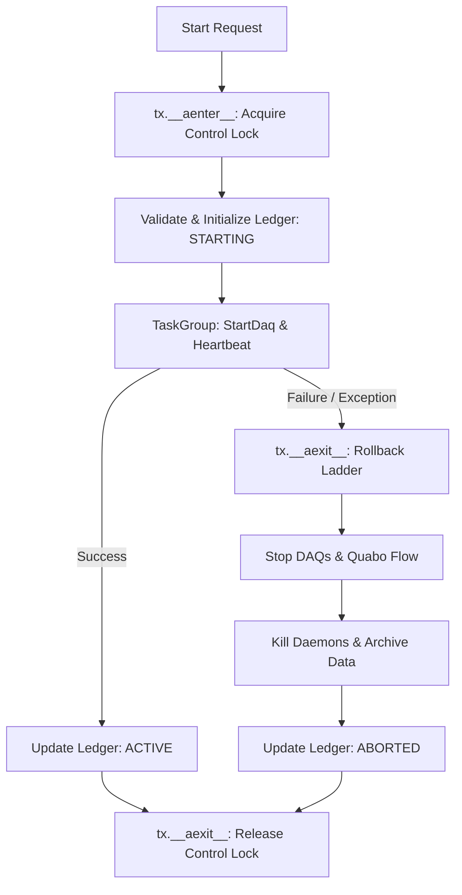
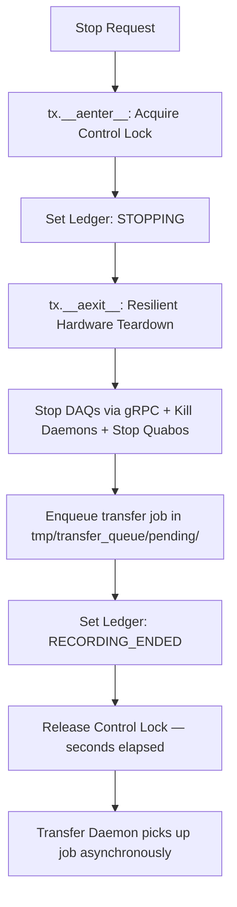
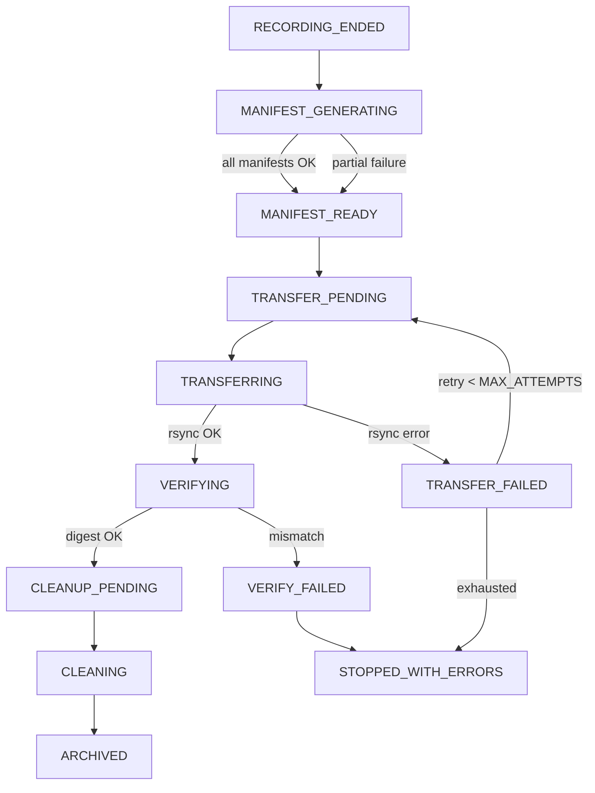
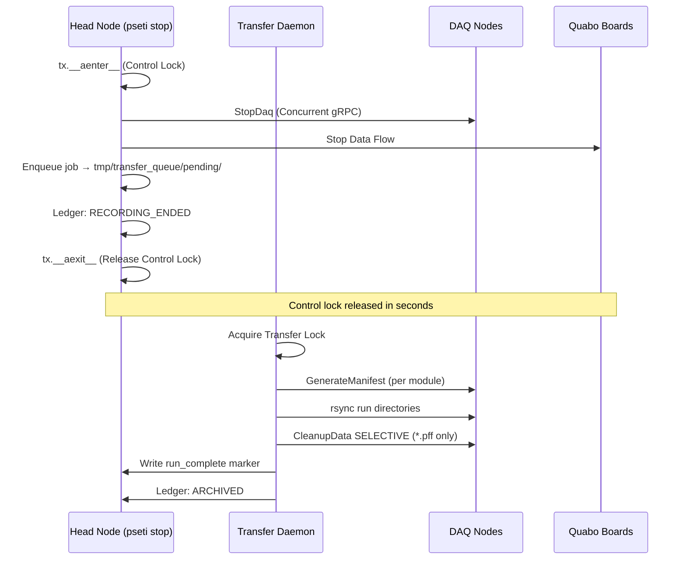

# Observing Run Transactions

This document describes the transactional integrity and rollback mechanisms implemented in the PANOSETI observatory control plane (`pseti start` and `pseti stop`) using the **Context Manager Architecture**, and the decoupled Transfer Daemon that owns all bulk I/O.

## Overview

The observatory control plane manages a distributed system (Head node, DAQ nodes, Quabo detectors). Starting or stopping an observation is handled atomically by `StartTransaction` and `StopTransaction` context managers in `control/utils/run_state.py`. Since the `pseti stop` refactor, bulk data transfer (rsync, manifest generation, selective cleanup) is decoupled from the advisory lock and executed by `daemons/transfer_daemon.py`.

## State Management & Locking

### Advisory Lock Hierarchy

Two separate advisory locks prevent concurrent operations at different granularities:

| Lock file | Mechanism | Held by | Duration |
|---|---|---|---|
| `tmp/panoseti_control.lock` | `os.O_EXCL` + stale-PID healing | `pseti start` / `pseti stop` | Seconds (hardware I/O only) |
| `tmp/panoseti_transfer.lock` | `fcntl.LOCK_EX \| LOCK_NB` | Transfer Daemon | Full job duration (minutes to hours) |

The control lock uses atomic file creation (`O_CREAT | O_EXCL`). If acquisition fails, the PID inside the file is checked — a dead PID causes a self-healing delete and retry (SC-015/SC-021). The transfer lock uses `flock`, which the kernel releases automatically on process exit.

## High-Performance Orchestration

Starting with Phase 4 of the architectural modernization, the control plane uses native asynchronous gRPC for all distributed operations:

- **Async-Native gRPC**: Utilizes `AsyncDaqControlClient` (built on `grpc.aio`) for non-blocking coordination of the DAQ fleet.
- **Strict Parameter Validation**: All gRPC requests are validated client-side via dedicated Pydantic `client_models.py` before hitting the network.
- **Concurrent Execution**: Multi-node operations (Start/Stop/Status) are executed in parallel using `asyncio.TaskGroup`, ensuring the head node can scale to large observatory topologies without thread-pool bottlenecks.
- **Authoritative Resolution**: `util.get_quabo_ip_port()` is the single source of truth for resolving effective Quabo addresses, correctly handling Gateway port forwarding for both TCP (gRPC) and UDP (Command) traffic.

### Distributed Ledger

The system state is persisted in a TOML-based ledger (`tmp/run_state.toml`).

**Full status vocabulary:**

| Status | Owner | Meaning |
|---|---|---|
| `STARTING` | pseti start | Hardware bring-up in progress |
| `ACTIVE` | pseti start | Observation recording |
| `ABORTED` | pseti start | Rollback completed after startup failure |
| `STOPPING` | pseti stop | Hardware teardown in progress |
| `RECORDING_ENDED` | pseti stop | Hardware stopped; transfer job enqueued |
| `MANIFEST_GENERATING` | daemon | DAQ nodes computing checksums |
| `MANIFEST_READY` | daemon | All manifests generated |
| `TRANSFER_PENDING` | daemon | Awaiting rsync start |
| `TRANSFERRING` | daemon | rsync in progress |
| `TRANSFER_FAILED` | daemon | rsync failed; will retry |
| `VERIFYING` | daemon | Checking transferred files |
| `VERIFY_FAILED` | daemon | Digest mismatch detected |
| `CLEANUP_PENDING` | daemon | Awaiting selective cleanup |
| `CLEANING` | daemon | Removing .pff files from DAQ nodes |
| `ARCHIVED` | daemon | run_complete marker written |
| `COMPLETED` | (legacy) | Synonymous with ARCHIVED in old code |
| `STOPPED_WITH_ERRORS` | daemon | Archive complete but with errors |

**Node receipts** (`NodeReceipt` in `pydantic_config_models.py`) track per-DAQ-node state including `manifest_path`, `manifest_bytes`, `rsync_bytes_transferred`, `rsync_last_progress_at`, `verify_ok`, and `cleanup_ok`.

---

## Start Transaction (`StartTransaction`)

Managed via `async with StartTransaction(...) as tx:`.

### 1. `__aenter__`
- Acquires the control advisory lock.
- Returns the transaction context.

### 2. Execution Phase (in `start_run`)
- **Pre-flight**: Validates configs, checks Quabo reachability.
- **Initialize**: Writes `STARTING` status and node receipts.
- **Start**: Launches local daemons, concurrent `StartDaq` RPCs, and heartbeat probes.

### 3. `__aexit__` (Rollback Ladder)
If an exception occurs (e.g., node timeout), `__aexit__` triggers the rollback:
1. **Stop Attempted DAQs**: Concurrent `StopDaq` for nodes with receipts.
2. **Stop Quabo Flow**: Halt data transmission.
3. **Kill Local Daemons**: Cleanup HK/HV/Temp processes.
4. **Archive artifacts**: Move partial run data to `_aborted/` with a context dump.
5. **Update Ledger**: Mark as `ABORTED`.
6. **Release Lock**.

### Start Flow Diagram


---

## Stop Transaction (`StopTransaction`)

Managed via `async with StopTransaction(...) as tx:`.

### 1. `__aenter__`
- Acquires the control advisory lock.

### 2. `__aexit__` (Teardown sequence)
Ensures **resilient best-effort hardware shutdown**. All steps execute even if previous ones fail. Bulk I/O is NOT in this sequence:

1. **Stop DAQs**: Concurrent `StopDaq` RPCs to all DAQ nodes.
2. **Kill Daemons**: Terminate local control processes (HV updater, HK recorder, etc.).
3. **Stop Quabos**: Signal hardware to halt data generation.
4. **Enqueue transfer job**: Write `{run_name}.job.toml` to `tmp/transfer_queue/pending/`.
5. **Update Ledger**: Transition to `RECORDING_ENDED`.
6. **Release Control Lock** — happens in seconds, not hours.

### Stop Flow Diagram


---

## Transfer Daemon (`daemons/transfer_daemon.py`)

The daemon is a long-running process started by `session_start.py`. It holds `tmp/panoseti_transfer.lock` as a singleton guard. Multiple `pseti stop` invocations never contend with it.

### Job Lifecycle

```
tmp/transfer_queue/
  pending/    → daemon calls claim() → active/
  active/     → success → completed/
  active/     → failure after MAX_ATTEMPTS → failed/
```

All transitions use `os.rename` (POSIX-atomic).

### State Machine per Job



### Selective Cleanup

The daemon calls `CleanupData(mode=CLEANUP_SELECTIVE)` with:
- `delete_patterns = ["*.pff"]` — science files removed from DAQ nodes
- `preserve_patterns = ["*.json", "*.log", "*.toml"]` — metadata retained on-DAQ as a permanent catalog

---

## Network Interaction


