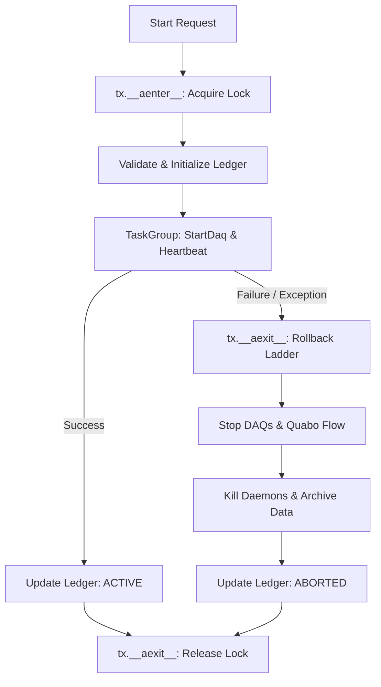
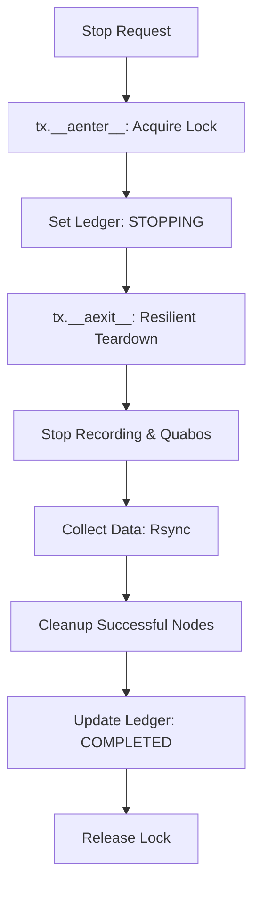
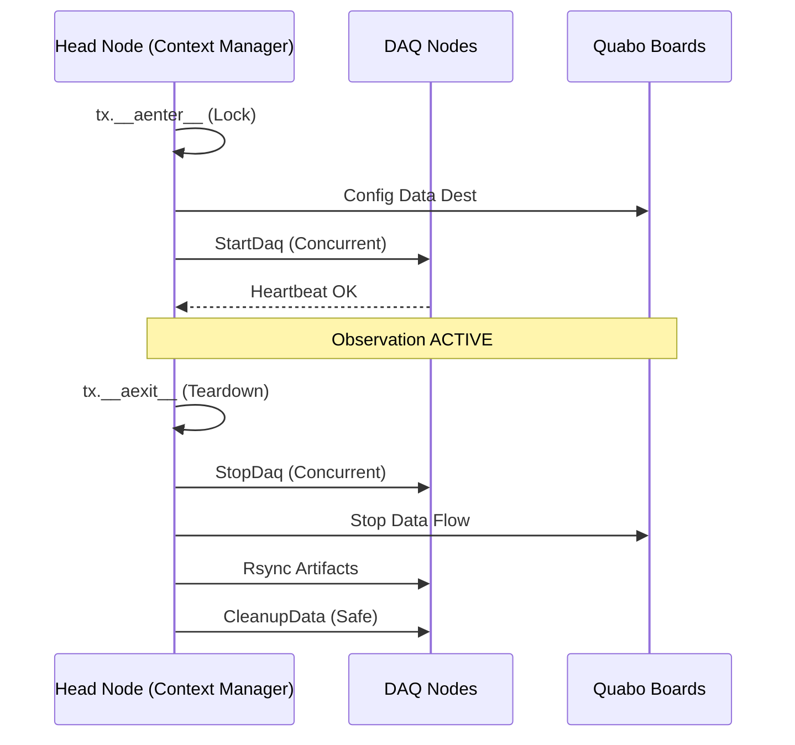

# Observing Run Transactions

This document describes the transactional integrity and rollback mechanisms implemented in the PANOSETI observatory control plane (`start.py` and `stop.py`) using **Context Manager Architecture**.

## Overview

The observatory control plane manages a distributed system (Head node, DAQ nodes, Quabo detectors). Starting or stopping an observation is an atomic operation handled by `StartTransaction` and `StopTransaction` classes in `control/utils/run_state.py`.

## State Management & Locking

### Advisory Locking
To prevent concurrent operations, all control processes must acquire an exclusive advisory lock. 
- **Implementation**: Uses low-level `os.open` with `O_CREAT | os.O_EXCL` on `tmp/panoseti_control.lock`.
- **Self-Healing**: If lock acquisition fails, the system checks the PID inside the lock file. If the process is dead, the lock is automatically cleared (SC-015/SC-021).
- **Safety**: Locked for the entire duration of the transaction via `__aenter__` and `__aexit__`.

### Distributed Ledger
The system state is persisted in a TOML-based ledger (`tmp/run_state.toml`).
- **Statuses**: `STARTING`, `ACTIVE`, `STOPPING`, `COMPLETED`, `ABORTED`, `STOPPED_WITH_ERRORS`.
- **Node Receipts**: Track DAQ status (PID, data dir) to guide rollback/teardown.

---

## Start Transaction (`StartTransaction`)

Managed via `async with StartTransaction(...) as tx:`.

### 1. `__aenter__`
- Acquires the advisory lock.
- Returns the transaction context.

### 2. Execution Phase (in `start_run`)
- **Pre-flight**: Validates configs, checks Quabo reachability.
- **Initialize**: Writes `STARTING` status and node receipts.
- **Start**: Launches local daemons, concurrent `StartDaq` RPCs, and heartbeat probes.

### 3. `__aexit__` (Rollback Ladder)
If an exception occurs (e.g., node timeout), `__aexit__` triggers the rollback:
1. **Stop Attempted DAQs**: Concurrent `StopDaq` for nodes with receipts.
2. **Stop Quabo Flow**: Halt data transmission.
3. **Kill Local Daemons**: Cleanup HK/HV/Temp processes.
4. **Archive artifacts**: Move partial run data to `_aborted/` with a context dump.
5. **Update Ledger**: Mark as `ABORTED`.
6. **Release Lock**.

### Start Flow Diagram

---

## Stop Transaction (`StopTransaction`)

Managed via `async with StopTransaction(...) as tx:`.

### 1. `__aenter__`
- Acquires the advisory lock.

### 2. `__aexit__` (Teardown sequence)
Ensures **resilient best-effort shutdown**. All steps execute even if previous ones fail:
1. **Stop DAQs**: Concurrent `StopDaq` RPCs.
2. **Kill Daemons**: Terminate local control processes.
3. **Stop Quabos**: Signal hardware to halt data generation.
4. **Collect Data**: Rsync artifacts with transient error retries.
5. **Cleanup**: Call `CleanupData` only for nodes where collection succeeded.
6. **Finalize**: Update ledger (`COMPLETED` or `STOPPED_WITH_ERRORS`) and release lock.

### Stop Flow Diagram

---

## Network Interaction

