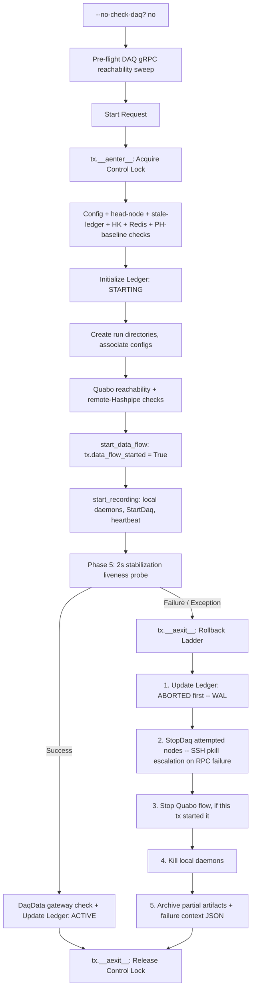
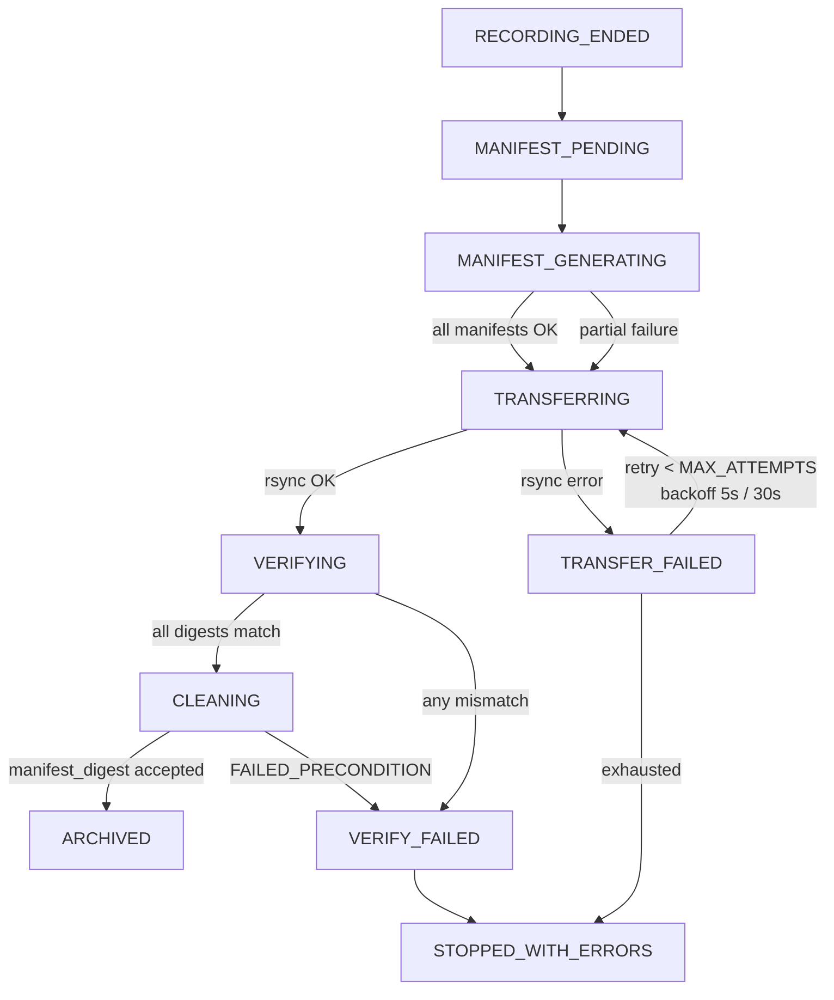
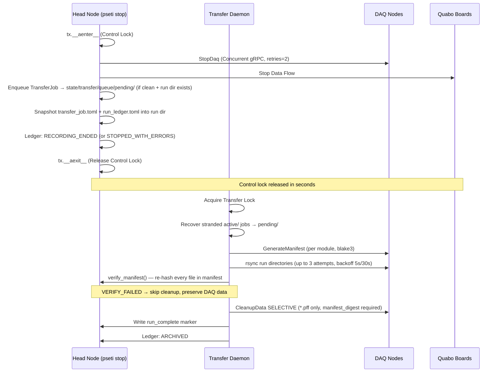

# Observing Run Transactions

This document describes the transactional integrity and rollback mechanisms implemented in the PANOSETI observatory control plane (`pseti start` and `pseti stop`) using the **Context Manager Architecture**, and the decoupled Transfer Daemon that owns all bulk I/O.

## Overview

The observatory control plane manages a distributed system (Head node, DAQ nodes, Quabo detectors). Starting or stopping an observation is handled atomically by `StartTransaction` and `StopTransaction` context managers — **each split into its own module**, not defined inside `start.py`/`stop.py`:

| Concern | Module |
|---|---|
| `StartTransaction` (rollback ladder, lock management) | `start_transaction.py` |
| Pre-flight validation/reachability checks for start | `start_preflight.py` |
| `start_run()` orchestration + CLI (`pseti start`) | `start.py` |
| `StopTransaction` (teardown ladder, lock management) | `stop_transaction.py` |
| `stop_run()` orchestration + CLI (`pseti stop`) | `stop.py` |

Bulk data transfer (rsync, manifest generation, selective cleanup) is decoupled from the advisory lock and executed by the Transfer Daemon (`control/src/control/transfer/daemon.py`).

## State Management & Locking

### Advisory Lock Hierarchy

Three separate advisory locks prevent concurrent operations at different granularities:

| Lock file | Mechanism | Held by | Duration |
|---|---|---|---|
| `state/locks/panoseti_control.lock` | `SoftFileLock` (`O_EXCL` wrapper) | `pseti start` / `pseti stop` | Seconds (hardware I/O only) |
| `state/locks/transfer.lock` | `SoftFileLock` (`O_EXCL` wrapper) | Transfer Daemon | Full job duration (minutes to hours) |
| `state/locks/interleave.lock` | `SoftFileLock` (`O_EXCL` wrapper) | Interleave Controller | Full observing run duration |

All locks are implemented using the `SoftFileLock` class from the `filelock` package. This mechanism uses atomic file creation (`O_CREAT | O_EXCL`) and is fully compatible with Docker volumes (where `fcntl`/`flock` is unreliable). `RunStateManager.acquire_lock()` waits up to 5 seconds before raising `LockError`; the ledger's own stale-`STARTING`/`STOPPING` self-heal (below), not the lock timeout, is what actually clears a crashed run.

## High-Performance Orchestration

Starting with Phase 4 of the architectural modernization, the control plane uses native asynchronous gRPC for all distributed operations:

- **Async-Native gRPC**: Utilizes `AsyncDaqControlClient` (built on `grpc.aio`) for non-blocking coordination of the DAQ fleet.
- **Strict Parameter Validation**: All gRPC requests are validated client-side via dedicated Pydantic `client_models.py` before hitting the network.
- **Concurrent Execution**: Multi-node operations (Start/Stop/Status) are executed in parallel using `asyncio.TaskGroup`, ensuring the head node can scale to large observatory topologies without thread-pool bottlenecks.
- **Authoritative Resolution**: `util.get_quabo_ip_port()` is the single source of truth for resolving effective Quabo addresses, correctly handling Gateway port forwarding for both TCP (gRPC) and UDP (Command) traffic.

### Distributed Ledger

The system state is persisted in a TOML-based ledger (`state/runs/ledger.toml`). State transitions are automatically logged by the `RunStateManager` to facilitate debugging.

**Full status vocabulary (`RunStatus` Enum, `pydantic_config_models.py`):**

| Status | Owner | Meaning |
|---|---|---|
| `STARTING` | pseti start | Hardware bring-up in progress |
| `ACTIVE` | pseti start | Observation recording |
| `ABORTED` | pseti start | Rollback completed after startup failure |
| `STOPPING` | pseti stop | Hardware teardown in progress |
| `RECORDING_ENDED` | pseti stop | Hardware stopped cleanly; transfer job enqueued |
| `STOPPED_WITH_ERRORS` | pseti stop / daemon | Two distinct paths land here: (1) `pseti stop`'s own teardown raised an unhandled error before completing cleanly — no transfer job gets enqueued for this outcome; (2) the Transfer Daemon exhausted its retry ladder after a job was already enqueued. The ledger doesn't distinguish which; check the log / `last_transfer_error`. |
| `MANIFEST_PENDING` | daemon | Job claimed; about to request manifests |
| `MANIFEST_GENERATING` | daemon | DAQ nodes computing checksums |
| `MANIFEST_READY` | daemon | All manifests generated |
| `TRANSFER_PENDING` | daemon | Awaiting rsync start |
| `TRANSFERRING` | daemon | rsync in progress; `transfer_attempts` mirrored to ledger |
| `TRANSFER_FAILED` | daemon | rsync failed; `last_transfer_error` mirrored to ledger |
| `VERIFYING` | daemon | Checking transferred files |
| `VERIFY_FAILED` | daemon | Digest mismatch detected; mirrored to ledger |
| `CLEANUP_PENDING` | daemon | Awaiting selective cleanup |
| `CLEANING` | daemon | Removing .pff files from DAQ nodes |
| `ARCHIVED` | daemon | run_complete marker written |
| `COMPLETED` | (legacy) | Synonymous with ARCHIVED in old code |

**Node receipts** (`NodeReceipt` in `pydantic_config_models.py`) track per-DAQ-node state including `status` (`NodeStatus`: `STARTING`, `START_SUCCESS`, `START_FAILED`, `STOPPED`), `manifest_path`, `manifest_bytes`, `rsync_bytes_transferred`, `rsync_last_progress_at`, `verify_ok`, and `cleanup_ok`.

### Ledger Mirroring

The Transfer Daemon maintains "Ledger Truth" by mirroring its internal state onto the central run ledger. Every time a transfer attempt is incremented or an error is encountered, the daemon calls `state_mgr.transition()` to update the ledger's `transfer_attempts` and `last_transfer_error` fields. This allows operators to inspect the ledger at any time (e.g., via `pseti stat ledger`) to understand why a transfer is retrying or has failed.

---

## Start Transaction (`StartTransaction`)

Managed via `async with StartTransaction(...) as tx:` in `start.py`'s `start_run()`. `StartTransaction` (`start_transaction.py`) only owns the lock and the rollback ladder — all pre-flight validation and the DAQ-start/heartbeat sequence live in `start_run()` / `start_recording()` / `start_preflight.py`, inside the `with` block.

### 0. Before the transaction: DAQ reachability sweep

Before `StartTransaction` is entered at all, `start_run()` optionally runs `_check_daq_reachability()` (`start_preflight.py`) — a parallel gRPC `StatusDaq` ping against every configured DAQ node. Skipped with `--no-check-daq`.

### 1. `__aenter__`
- Acquires the control advisory lock.
- Returns the transaction context. Nothing else — no ledger reads, no validation.

### 2. Execution Phase (in `start_run()`, inside the `with` block)

In order:
1. **Config validation**: `config_file.validate_all(check_network=False)`.
2. **Head-node identity**: `util.is_local(daq_config.head_node_ip_addr, ...)`.
3. **Stale ledger self-heal** (see below).
4. **HK recorder not already running.**
5. **Redis daemons**: if not running, `start_run()` actively starts them and waits 2s — only fails if that auto-start itself fails.
6. **PH baseline file** exists, non-empty, < 24h old.
7. **Ledger initialized**: writes `STARTING`; `tx.ledger_initialized = True` from here on.
8. **Run directories created**, unless `--no-data`.
9. `get_sw_info()`, `config_file.associate()`, `show_daq_assignments()`.
10. **Quabo reachability sweep** — unless `--no-data`; runs *after* run-directory creation.
11. **Remote Hashpipe not running** — unless `--no-data`.
12. **Start data flow**: `tx.data_flow_started = True` set immediately before `start_data_flow()`.
13. **`start_recording()`**: local daemons, concurrent `StartDaq`, heartbeat, stabilization liveness probe (below).
14. **DaqData gateway status check**, optional re-init if `--init-snapshot` (default on) — warn-only, not a pass/fail gate.
15. **Mark `ACTIVE`**; `tx.success = True`.

### `start_recording()` in detail

Its docstring says "≤5 attempts" but `start_run()` actually calls it with **`startdaq_retries=15`** for both the `StartDaq` retry loop and the heartbeat probe loop, 1s apart. Four phases:

1. Local daemons: HK recorder, then (unless `--no-hv`) HV updater and temperature monitor.
2. Concurrent `StartDaq` per node (`TaskGroup`); retries transient `UNAVAILABLE` up to 15x.
3. Heartbeat probe (`probe_node`): up to 15 attempts, 1s apart, polling `StatusDaq`.
4. **Phase 5 — stabilization liveness probe** (`verify_liveness_final`): sleeps 2s, then re-polls `StatusDaq` once more. This is the exact check behind the `hashpipe exited during stabilization` error — a distinct, later phase from the heartbeat loop, not a retry of it.

### 3. `__aexit__` (Rollback Ladder)

If an exception occurs anywhere in the `with` block, `__aexit__` triggers the rollback. **The ledger is updated first** (write-ahead-log pattern), not last:

1. **Update ledger to `ABORTED`** — only if `tx.ledger_initialized`. Re-loads the ledger first to pick up node receipts written just before cancellation.
2. **Stop remote DAQs**: concurrently, only for nodes in `tx.nodes_attempted`. `StopDaq` over gRPC; **if that fails, escalates to `ssh ... pkill -9 hashpipe`** (honoring port-forwarding gateway/port) as a last-resort hard kill.
3. **Stop Quabo data flow**: only if `tx.data_flow_started`.
4. **Kill local daemons**: HK recorder, HV updater, temperature monitor.
5. **Archive partial artifacts**: moves the local run directory to `_aborted/{run_name}[_N]/`, writes `start_failure_context.json` (exception message + full traceback).
6. **Release the lock** — always, in `finally`.

**Exception suppression**: `ValidationError` is always suppressed (clean exit). Any other exception is suppressed too, *unless* it's `KeyboardInterrupt`, `SystemExit`, or `asyncio.CancelledError` (those propagate). Most `StartDaq`/heartbeat failures are therefore already handled by the time `__aexit__` returns — `start_run()`'s own outer `except Exception` rarely fires.

### Start Flow Diagram


---

## Pre-flight Checks & Strictness Mode

`pseti start` runs a series of pre-flight checks before issuing any hardware commands. Whether a failing check aborts the transaction or merely warns the operator depends on the **strictness mode**.

### Strictness Resolution Order

1. **CLI flag** (highest priority): `--strict` or `--no-strict` passed at the command line.
2. **Environment variable**: `PSETI_STRICT=1` (strict) or `PSETI_STRICT=0` (lenient).
3. **Tier-aware default** (lowest priority):
   - **Lenient** (`strict=False`): when `daq_config.json` has `head_node_container: true` **AND** `PSETI_TEST_TIER` is one of `tier3_fleet`, `tier4_chaos`, or `tier5_integration`. This allows pure software CI to bypass hardware checks.
   - **Strict** (`strict=True`): all other cases — bare-metal deployments, hardware-in-the-loop (HITL) containers, or any container environment without a recognized CI tier.

The helper `_resolve_strict_mode(strict_flag, daq_config)` lives in `start_preflight.py` (moved out of `start.py` during the pre-flight-checks split).

### Pre-flight Check Inventory

| # | Check | Strict mode | Lenient mode | Gated by |
|---|---|---|---|---|
| — | DAQ node gRPC reachability (before the transaction) | Abort | Abort | `--no-check-daq` to skip |
| 1 | Config file validation (pydantic + cross-config rules) | **Abort** | **Abort** (always enforced) | — |
| 2 | Head-node identity (`util.is_local()` vs. config) | Abort | Warn + continue | — |
| 3 | **Ledger freshness** (no stale `ACTIVE`/`STARTING`/`STOPPING` ledger) | Abort | Abort (has its own force flag) | `--force-reset` |
| 4 | HK recorder not running (would conflict with new run) | Abort | Warn + continue | — |
| 5 | Redis daemons reachable (auto-started if not; only fails if auto-start fails) | Abort | Warn + continue | `--no-redis` |
| 6 | PH baseline file age (< 24 h) | Abort | Warn + continue | — |
| 7 | Quabo reachability (UDP ping each configured Quabo) | Abort | Warn + continue | `--no-data`; runs after run-dir creation |
| 8 | **Remote Hashpipe not running** (gRPC `StatusDaq` per DAQ node) | **Abort** | Warn + continue | `--no-data`; `--force-restart` auto-`StopDaq`s instead |
| — | DaqData gateway status (post-start, warn-only) | Warn | Warn | `--init-snapshot` (default on) also re-initializes |

### Stale Ledger Self-Healing (Check #3)

The control plane implements PID-based self-healing for crashed transactions. If the ledger indicates a run is in progress:

- **`STARTING` or `STOPPING`**: If the PID recorded in the ledger is no longer alive on the head node, the ledger is declared stale and automatically archived to `_aborted/`.
- **`ACTIVE`**: PID-based healing is **disabled**. An `ACTIVE` run is considered valid even if the `pseti start` process that created it has exited. To clear an `ACTIVE` run, use `pseti stop` or `pseti start --force-reset`.

Check #8 is the most critical: it prevents a `pseti start` from issuing UDP reconfiguration to Quabos while an existing observation is in progress on the same hardware.

### Remote Hashpipe Pre-flight (Check #8)

The helper `_check_no_remote_hashpipe(daq_config, net_client, force_restart=False)` in `start_preflight.py` queries every DAQ node via `StatusDaq(check_hashpipe_running=True)`. If any node reports `hashpipe_running=True`:

- **`force_restart=False`** (default): raises `ValidationError("Hashpipe already running on {ip}")`. The `StartTransaction.__aexit__` rollback ladder is triggered — but because `start_data_flow` has not yet been called, the `data_flow_started` flag is `False` and `stop_data_flow` is **not** called. The pre-existing observation continues unharmed.
- **`force_restart=True`** (`--force-restart` CLI flag): calls `StopDaq` on each offending node, then continues.

### `data_flow_started` Safety Invariant

`StartTransaction` tracks whether `start_data_flow()` (which sends UDP configuration commands to Quabos) has actually been called, via `self.data_flow_started: bool`.

```
data_flow_started = False   (initial)
     ↓
_check_no_remote_hashpipe()   ← abort here: data_flow_started stays False
     ↓
tx.data_flow_started = True   ← set immediately before call
     ↓
start_data_flow(...)          ← UDP commands sent to Quabos
```

In `__aexit__` (rollback ladder, Step 3):

```python
if self.data_flow_started:
    stop_data_flow(...)   # only undo what THIS transaction started
```

**This invariant guarantees:** a failed `pseti start` that aborts before issuing UDP commands will never call `stop_data_flow` — which would otherwise halt data flow for any co-existing valid observation on the same Quabos.

---

## Stop Transaction (`StopTransaction`)

Managed via `async with StopTransaction(...) as tx:` in `stop.py`'s `stop_run()`. Like `StartTransaction`, the class itself (`stop_transaction.py`) only owns the lock and the teardown ladder — pre-flight validation is in `stop_run()`.

### 1. `__aenter__`

Acquires the control advisory lock. That's it — no ledger read, no validation. (Both transactions follow the same "lock only in `__aenter__`" shape.)

### 2. Pre-flight Validation (in `stop_run()`, inside the `with` block)

1. **Head-node identity** — warns instead of aborting when `daq_config.head_node_container` is set; raises `ValidationError` otherwise.
2. **Load the ledger**, tolerating corrupt/missing TOML (warns, proceeds with `ledger = None`).
3. **Resolve the run to stop**: `--run` argument, else ledger's `run_name`, else legacy `util.read_run_name()`.
4. **Nothing to stop**: no run name resolves at all → return success immediately.
5. **Refuse if already terminal**: ledger status not in `{STARTING, ACTIVE, STOPPING}` → `ValidationError` unless `--force-stop`.
6. **Refuse on run-name mismatch**: `--run` names something other than the ledger's current run → `ValidationError` unless `--force-stop`.
7. **Transition to `STOPPING`.**

A `ValidationError` here is caught by `StopTransaction.__aexit__` and treated as a **successful no-op** (`tx.success = True`, suppressed) — not a failure.

### 3. `__aexit__` (Teardown sequence)

Ensures **resilient best-effort hardware shutdown**. All steps execute even if previous ones fail (errors collected into `tx.all_errors`, not raised). If the `with` block raised something other than a clean `ValidationError` no-op, the ladder *still* runs, but the final outcome differs:

1. **Stop DAQs**: `net_client.stop_daq_node(node, timeout_s=20.0, retries=2)` per node, concurrently.
   - **Robust Termination Ladder**: the DAQ node server performs a global sweep for **all** `hashpipe` processes. It sends `SIGINT`, waits up to **60 seconds** for graceful termination (allowing data buffer flush), then escalates to `SIGKILL` for survivors.
   - **Sidecar Cleanup**: the server also ensures the `capture_hk.py` recorder is terminated.
2. **Kill Daemons**: HV updater, HK recorder, temperature monitor, in that order.
3. **Stop Quabos**: signal hardware to halt data generation.
4. **Enqueue transfer job**: **only if `can_enqueue = (exc_type is None) and run_dir_exists`** — if the pre-flight body raised something unexpected before reaching `__aexit__` normally, or the local run dir is missing, no job is created regardless of hardware-teardown outcome. When it does happen:
   - Writes a `recording_ended` marker file if not already present.
   - Builds/enqueues a `TransferJob`, writing `{run_name}.job.toml` to `state/transfer/queue/pending/`. Skipped (but still "clean") if `--no-transfer`.
   - **Snapshots `transfer_job.toml` and `run_ledger.toml` into the run directory itself** — makes the `.pffd` a self-contained record of the run lifecycle.
5. **Finalize the ledger**: `RECORDING_ENDED` if the `with` block completed cleanly, **`STOPPED_WITH_ERRORS` if it didn't**.
6. **Release Control Lock** — always, in `finally`.

### TransferJob schema — the stop→daemon contract

`pseti stop` constructs a `TransferJob` (defined in `control/src/control/transfer/models.py`) and serializes it as TOML into the pending queue. The daemon parses it with `TransferJob.model_validate(toml.load(f))`. All fields round-trip exactly, including `port_forwarding`.

```toml
schema_version = 1
run_name = "start_2024-01-01T00:00:00Z.sci"
head_data_dir = "/data/panoseti"
head_node_username = "panoseti"
created_at = "2024-01-01T00:00:00+00:00"
attempts = 0
no_cleanup = false
no_collect = false
skip_verify = false

[[daq_nodes]]
ip_addr = "192.168.0.10"
username = "panoseti"
data_dir = "/data"
module_ids = [250, 251]

[daq_nodes.port_forwarding]
status = true
gw_ip = "10.0.1.254"
port = 2200
```

**Key invariant**: the `port_forwarding` block is preserved from `daq_config.json` through `TransferNodeSpec` into the TOML. Prior to this refactor, the field was silently dropped, causing rsync to fail over the physical router when the observatory uses a VPN gateway.

### Stop Flow Diagram
```mermaid
flowchart TD
    A[Stop Request] --> B[tx.__aenter__: Acquire Control Lock]
    B --> C0[Head-node identity, load ledger, resolve run name]
    C0 -- no run resolved --> C0a[Return success: nothing to stop]
    C0 --> C1{Ledger status stoppable\nor --force-stop?}
    C1 -- No --> C1a[ValidationError -- treated as clean no-op]
    C1 -- Yes --> C2[Set Ledger: STOPPING]
    C2 --> D[tx.__aexit__: Teardown Ladder]
    D --> D1[1. StopDaq all nodes -- errors collected, not raised]
    D1 --> D2[2. Kill local daemons: HV, HK, temp monitor]
    D2 --> D3[3. Stop Quabo data flow]
    D3 --> D4{can_enqueue?\nwith-block exc is None\nAND run dir exists}
    D4 -- Yes, not --no-transfer --> D4a[Build+enqueue TransferJob\nsnapshot transfer_job.toml + run_ledger.toml into run dir]
    D4 -- No --> D4b[Skip enqueue]
    D4a --> D5
    D4b --> D5{with-block exc is None?}
    D5 -- Yes --> D5a[Ledger: RECORDING_ENDED]
    D5 -- No --> D5b[Ledger: STOPPED_WITH_ERRORS]
    D5a --> F[Release Control Lock -- seconds elapsed]
    D5b --> F
    F --> K[Transfer Daemon picks up job asynchronously, if enqueued]
```

### `pseti stop` flags

| Flag | Effect |
|---|---|
| `--no-transfer` | Skip enqueue entirely; data stays on DAQ nodes. |
| `--keep-daq-data` | Sets `no_cleanup=True` on the job (.pff files preserved after archive). |
| `--skip-verify` | Sets `skip_verify=True` on the job (manifest re-hash skipped). Discouraged — CLI prints a warning. |
| `--force-stop` | Bypasses the ledger stoppable-status and run-name-match checks; runs the teardown ladder anyway. |
| `--yes / -y` | Auto-confirm safety prompts including daemon-down warning. |

**Daemon-down warning**: the CLI layer (`stop.py`'s `main()`, not `stop_run()` itself) checks the heartbeat at `state/transfer/daemon.heartbeat` before enqueuing (30s staleness threshold). If the daemon is stale:
- Interactive TTY: prompts the operator to confirm before enqueuing.
- Non-interactive / `--yes`: enqueues and emits a WARNING log.
- Skipped entirely if `--no-transfer`.

---

## Transfer Daemon (`control/transfer/daemon.py`)

### Lifecycle

The daemon is started by `session_start.py` via `util.start_daemon(["python", "-m", "control.transfer"])` after Redis daemons. It writes its PID to `state/transfer/daemon.pid` and updates a heartbeat at `state/transfer/daemon.heartbeat` every 5 seconds.

`session_stop.py` sends SIGTERM and waits up to 30 seconds for the daemon to finish its current processing step before escalating to SIGKILL. An in-flight rsync is always allowed to complete its current attempt before the daemon exits.

On receipt of SIGTERM/SIGINT the daemon: finishes the current stage, moves any active job back to `pending/` (crash recovery), then releases the flock and exits cleanly.

### Queue Layout

```
state/transfer/queue/
  pending/    {run_name}.job.toml   ← pseti stop writes here
  active/     {run_name}.job.toml   ← daemon moves here on claim()
  failed/     {run_name}.job.toml   ← daemon moves here after MAX_ATTEMPTS
  completed/  {run_name}.job.toml   ← daemon moves here on success
```

All transitions use `os.rename` (POSIX-atomic). Double-enqueue of the same run is idempotent.

### Job Lifecycle

```
pending/ → daemon calls claim() → active/
active/  → success              → completed/
active/  → failure MAX_ATTEMPTS → failed/
```

### State Machine per Job



### Integrity Invariant — No Deletion Without Verified Integrity

The VERIFYING stage calls `verify_manifest()` (`transfer/verify.py`) on every manifest file found on the head node (`manifest.blake3`, `manifest.xxh3_128`, `manifest.sha256`).  Each file listed in the manifest is re-hashed and compared against the recorded digest.  On any mismatch the daemon transitions to `VERIFY_FAILED`, logs the exact file paths, and **skips cleanup** — DAQ-side `.pff` files are preserved for manual recovery.

The CLEANING stage passes `manifest_digest` (SHA-256 of the manifest file content) to `CleanupData(mode=CLEANUP_SELECTIVE)`.  The DAQ Control server recomputes the digest of its local manifest and refuses the RPC with `FAILED_PRECONDITION` if the values differ.  This closes the loop: the head node must prove it verified the same manifest the DAQ node generated, or deletion is impossible.

### Selective Cleanup

The daemon calls `CleanupData(mode=CLEANUP_SELECTIVE, manifest_digest=<sha256_of_manifest>)` with:
- `delete_patterns = ["*.pff"]` — science files removed from DAQ nodes
- `preserve_patterns = ["*.json", "*.log", "*.toml"]` — metadata retained on-DAQ as a permanent catalog

### Retry Ladder

Constants live in `control/transfer/lifecycle.py`: `MAX_ATTEMPTS = 3`, `RETRY_DELAYS = [5, 30]` (seconds).

| Attempt | Backoff before next attempt |
|---|---|
| 1 → 2 | 5 s |
| 2 → 3 | 30 s |
| 3 (MAX) | → `failed/` queue, no retry |

### Daemon Crash Recovery

On startup the daemon sweeps `active/` for jobs left behind by a prior crash (SC-TX-005).  The `_sweep_stranded_jobs()` function:

- **Below `MAX_ATTEMPTS`**: renames the stranded job back to `pending/` so the next poll iteration retries it.
- **At or above `MAX_ATTEMPTS`**: moves the job directly to `failed/` with a sentinel `last_transfer_error`.  This breaks the **infinite-bounce** failure mode where a daemon that crashes every attempt would cycle the job through `active/ → pending/ → active/ → …` indefinitely without incrementing the persisted attempt count.

**Why the bounce is now impossible:** the daemon persists the incremented `attempts` count into `active/` **before** calling `_process_job` (pre-commit on claim).  If the daemon process dies mid-job, `_sweep_stranded_jobs` finds the job with the bumped count already on disk and uses it to decide whether to retry or permanently fail.  There is no window where a crashed daemon leaves an unincremented count.

---

## Operator Recovery (`pseti xfr`)

Use the `pseti xfr` sub-commands to inspect the queue and recover from failures.

| Command | Purpose |
|---|---|
| `pseti xfr stat` | Daemon health (heartbeat age, pid) + per-bucket job counts. |
| `pseti xfr stat <run>` | Show which bucket a specific run is in. |
| `pseti xfr queue [pending\|active\|completed\|failed]` | List jobs in a bucket. |
| `pseti xfr retry <run>` | Move a failed job back to pending/ (resets attempts). |
| `pseti xfr start` | Start the daemon (idempotent; no-op if already running). |
| `pseti xfr stop` | SIGTERM the daemon; wait up to 60 s for graceful exit. |
| `pseti xfr tail [-f] [-n N]` | Tail `state/logs/transfer_daemon/transfer_daemon.log`. |
| `pseti xfr verify <run>` | Run manifest verification standalone (no state transitions). |

**Common recovery flows:**

*Transfer daemon was down when `pseti stop` ran:*
```bash
pseti xfr stat          # confirm daemon is down
pseti xfr start           # restart it
# daemon auto-picks up the pending job
pseti xfr stat <run>      # confirm it moved to active/
```

*rsync failed and exhausted retries:*
```bash
pseti xfr queue failed    # confirm run is in failed/
# investigate root cause (disk space, network, SSH keys)
pseti xfr retry <run>     # move back to pending/
pseti xfr start           # ensure daemon is running
```

*Manifest digest mismatch (VERIFY_FAILED):*
```bash
pseti xfr verify <run>    # re-run verification to confirm which files differ
# DAQ data is preserved — do NOT run CleanupData manually
# Fix the head-side issue (re-rsync the specific file), then:
pseti xfr retry <run>
```

*`pseti stop` reported `STOPPED_WITH_ERRORS` and nothing was enqueued:* check the `PSETI.Stop` log for what raised before `__aexit__`; the run directory is left in place, so a manual `pseti stop --run <name> --force-stop` retry (after fixing the underlying issue) can still enqueue it.

---

## Network Interaction


