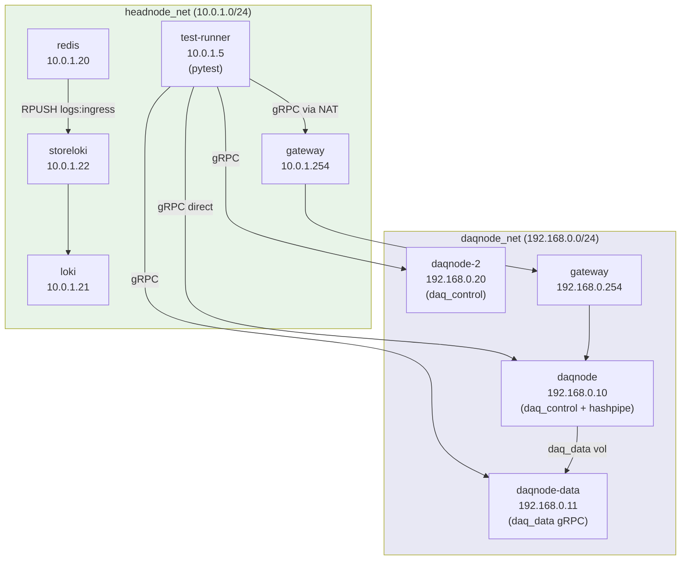

# PANOSETI Control — CI Test Suite

All tests live under `control/ci-tests/` and run inside Docker via a single
multi-stage `Dockerfile.ci`.

**Current status:** 460 unit tests passing · 43 integration tests passing, 7 skipped

---

## Quick Start

```bash
# From control/
bash ci-tests/run.sh unit          # hardware-agnostic unit tests (~10s, parallel)
bash ci-tests/run.sh integration   # full end-to-end integration suite

# Pass extra pytest args after the suite name
bash ci-tests/run.sh unit -- -k test_pff
bash ci-tests/run.sh integration -- -k "TestDaqLifecycle" --timeout=30

# Enable Loki/Redis telemetry tests (slower startup)
ENABLE_TELEMETRY_TESTS=1 bash ci-tests/run.sh integration

# Real hashpipe + tcpreplay data flow tests
RUN_REAL_DATA_TESTS=1 bash ci-tests/run.sh integration -- -k "real_data"
```

---

## Integration Test Architecture

The integration suite simulates a Palomar-like VPN topology using Docker networks:



**Shared volumes:**
- `daq_data` (`/data`) — PFF files shared between `daqnode`, `daqnode-data`, and `test-runner`
- `daq_data_2` (`/data`) — private volume for `daqnode-2` (prevents `module.config` conflicts)
- `hashpipe_uds` (`/tmp`) — hashpipe UDS sockets shared between `daqnode` and `daqnode-data`

### Why two daqnode containers?

`daq_control.server` and `daq_data.server` both use TCP port 50051.
Running them in the same container causes a port conflict. The workaround is
to give each server its own IP address so both can own port 50051 independently.

### Why `BINDHOST=lo`?

Docker virtual NICs (`eth0`) don't support the `TPACKET_V3` ring-buffer mode
that panoseti_daq's net_thread requires. Loopback (`lo`) does. All CI runs
use `BINDHOST=lo`; production uses `BINDHOST=eth0` (or the real interface name).

### hashpipe.so startup copy

The `integration-daqnode` image stores `hashpipe.so` at both `/data/hashpipe.so`
(in the image layer) and `/usr/local/lib/panoseti_hashpipe.so` (outside the
shared volume). The container entrypoint always copies from `/usr/local/lib/`
to `/data/` at startup, ensuring the plugin is available even if another
container initialized the shared `daq_data` volume first.

---

## Environment Variables

| Variable | Default | Description |
|---|---|---|
| `DAQNODE_DIRECT_HOST` | 192.168.0.10 | direct daq_control IP |
| `DAQNODE_DATA_HOST` | 192.168.0.11 | daq_data gRPC server IP |
| `DAQNODE2_HOST` | 192.168.0.20 | second DAQ node IP |
| `DAQNODE_GATEWAY_HOST` | 10.0.1.254 | socat gateway IP |
| `GRPC_PORT` | 50051 | gRPC port for all services |
| `DAQ_DATA_DIR` | /data | data directory on daqnode |
| `HEAD_DATA_DIR` | /data/head | data destination on headnode |
| `DAQNODE_CONTAINER_NAME` | ctl-int-daqnode-1 | Docker container name for pause/unpause tests |
| `BINDHOST` | lo | network interface for hashpipe packet socket (use `lo` in CI) |
| `RUN_REAL_DATA_TESTS` | (unset) | set to `1` to run tcpreplay/hashpipe tests |
| `ENABLE_TELEMETRY_TESTS` | (unset) | set to `1` to run Telemetry gRPC pipeline tests |

---

## Test Files

### Unit (`ci-tests/unit/`) — 460 tests

No hardware or networking required. Unit tests run in parallel with `pytest-xdist -n auto`.

| File | Coverage |
|---|---|
| `test_pydantic_models.py` | Config Pydantic schemas |
| `test_config_file.py` | Config loading, range expansion |
| `test_global_validator.py` | Cross-config rules |
| `test_config_validator.py` | Network reachability checks |
| `test_pff.py` | PFF file parser |
| `test_util.py` | Utility helpers |
| `test_redis_utils.py` | Redis key/stream utilities |
| `test_image_quantiles.py` | Image statistics |
| `test_quabo_driver.py` | UDP quabo driver: packet construction, opcodes, field encoding |
| `test_quabo_driver_protocol.py` | Protocol math: BOARDLOC/IP, HK packet layout, HV conversion, MAROC structure, trigger mask |

### Integration (`ci-tests/integration/`) — 43 tests passing, 7 skipped

Requires the full Docker compose stack.

| File | Tests | Coverage |
|---|---|---|
| `test_config_validation.py` | — | CI config files pass Pydantic + cross-config rules |
| `test_daq_lifecycle.py` | — | Start/Stop/Status lifecycle; disk usage; run dir isolation |
| `test_data_collection.py` | — | Collect + cleanup transaction; failure recovery; edge cases |
| `test_concurrent_daq_operations.py` | — | Concurrent start serialization; rapid Start→Stop cycles |
| `test_gateway_topology.py` | — | Gateway forwarding and state consistency |
| `test_two_node_direct.py` | — | Two independent DAQ nodes; isolation guarantees |
| `test_science_streaming.py` | — | daq_data gRPC simulation path (init_sim + stream_images) |
| `test_loki_pipeline.py` | — | Redis→Loki log shipping; severity; large payloads; burst |
| `test_hashpipe_logs.py` | 3 skipped | Hashpipe log forwarding — requires `ENABLE_TELEMETRY_TESTS=1` |
| `test_real_data_flow.py` | 4 skipped | tcpreplay→hashpipe→daq_data→headnode — requires `RUN_REAL_DATA_TESTS=1` |

---

## Real Hashpipe Tests

`test_real_data_flow.py` tests the full data path using tcpreplay to inject
PCAP packets into a live hashpipe process.  Skipped by default.

```bash
RUN_REAL_DATA_TESTS=1 bash ci-tests/run.sh integration -- -k "real_data"
```

Requirements (satisfied in the `integration-daqnode` Docker image):
- `hashpipe` binary + `hashpipe.so` plugin at `/data/hashpipe.so`
- `tcpreplay` in PATH
- PCAP file at `/app/ci-tests/integration/data/*.pcapng`
- `hashpipe_uds` volume shared at `/tmp` between `daqnode` and `daqnode-data`

---

## Local Development (without Docker)

```bash
cd control
pip install -e ".[dev]"

# Unit tests (fast)
pytest ci-tests/unit/ -v --tb=short

# Single test module
pytest ci-tests/unit/test_quabo_driver_protocol.py -v
```

---

## Requirements

- Docker Engine 24+
- Docker Compose v2 (`docker compose`, no hyphen)
- ~1 GB disk for the test images (Python 3.14 slim + hashpipe compilation)
