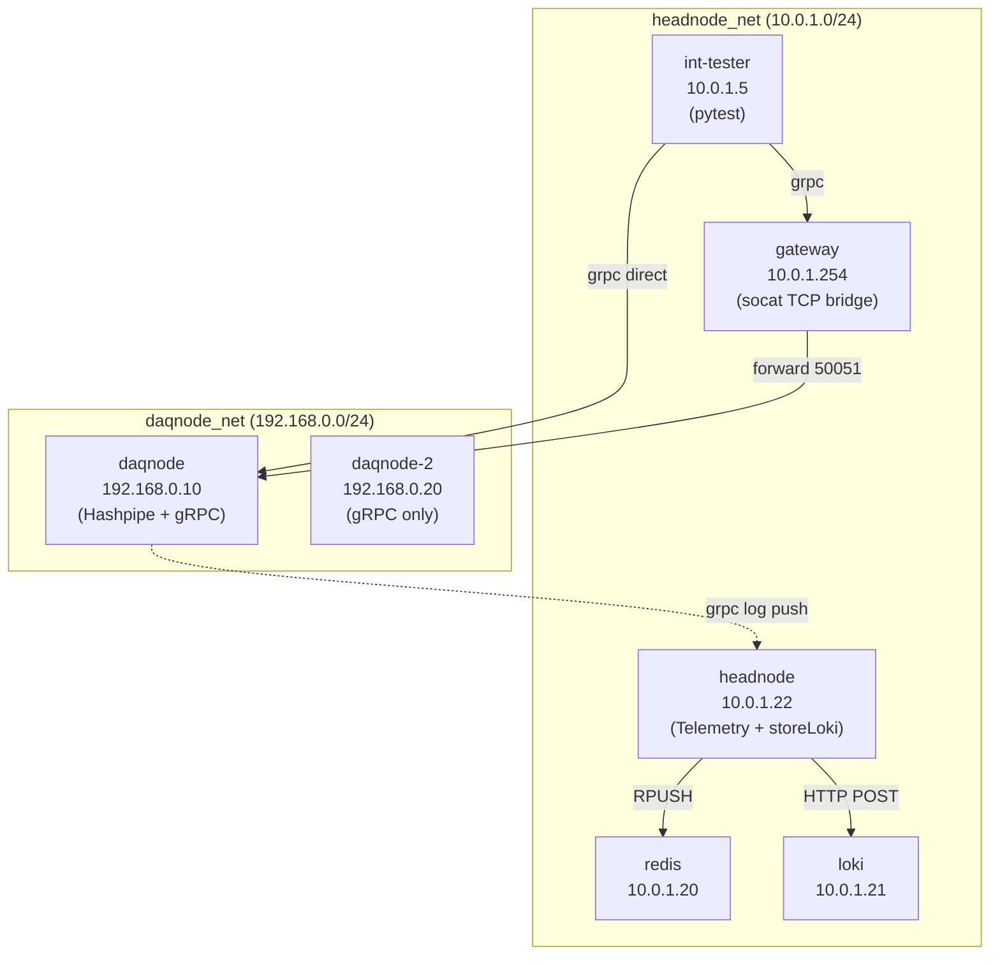

# PANOSETI Control — CI Test Suite

All tests live under `control/ci-tests/` and run inside Docker via a single
multi-stage `Dockerfile.ci` using `uv` for high-performance builds.

**Current status:** 460 unit tests passing · integration suite: 65 tests passing

---

## Quick Start

The new CI infrastructure uses **persistent background daemons**. You start the stack once, and then run tests instantly without waiting for container boot times.

```bash
# 1. Start the background infrastructure
python ci-tests/qa.py up

# 2. Run tests instantly
python ci-tests/qa.py unit           # Parallel unit tests (~3s)
python ci-tests/qa.py integration    # E2E integration tests (~75s)
python ci-tests/qa.py lint           # Ruff & MyPy (concurrent)

# 3. Targeted debugging (pass any pytest args)
python ci-tests/qa.py unit -k test_pff
python ci-tests/qa.py integration -k TestDaqLifecycle

# 4. Infrastructure management
python ci-tests/qa.py build          # Rebuild images (uv cached)
python ci-tests/qa.py restart        # Restart daemons
python ci-tests/qa.py down           # Tear down everything
```

---

## Modern CI Architecture

We have migrated to **Python 3.14** and **uv**. Our containers are designed to be "inner-loop" friendly:

*   **Persistent Daemons:** Containers run `sleep infinity` and are reused across test runs.
*   **Live Mounting:** The local `control/` directory is volume-mounted into `/app`. Edits you make on your host are instantly available for the next test run.
*   **Venv Isolation:** Python dependencies live in `/opt/venv`, safely isolated from your local volume mounts.
*   **Blazing Fast Builds:** We use BuildKit cache mounts (`--mount=type=cache,target=/root/.cache/uv`) and `uv sync` layers to ensure dependencies are only re-evaluated when `pyproject.toml` or `uv.lock` changes.

### Integration Topology

The integration suite simulates a Palomar-like VPN topology. Each daqnode runs
the **unified panoseti-server** and forwards logs to the **headnode** Telemetry gRPC service.



---

## Real Hashpipe Tests

The `real_data` test files validate the full data path using `tcpreplay` to inject PCAP packets into a live hashpipe process. These are now integrated into the standard suite and pass under the new architecture.

```bash
# Run only real data tests
python ci-tests/qa.py integration -k "real_data"
```

### The "Loopback Shortcut" Requirement
To guarantee packets reach Hashpipe in CI, the tests enforce **Loopback injection**:
1. Hashpipe is bound to the loopback interface (`BINDHOST=lo`).
2. `tcpreplay` injects packets directly into `lo`.
3. The Linux kernel uses the loopback shortcut to bypass MAC filtering and MTU restrictions.

---

## Local Development (without Docker)

If you prefer to run tests natively, ensure you have `uv` installed:

```bash
# Sync environment
uv sync --all-extras

# Run tests
uv run pytest ci-tests/unit/
```
