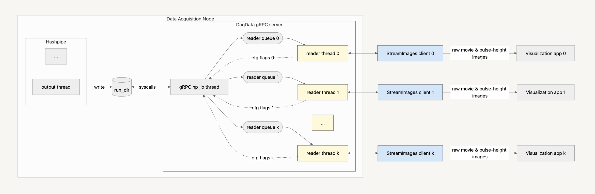
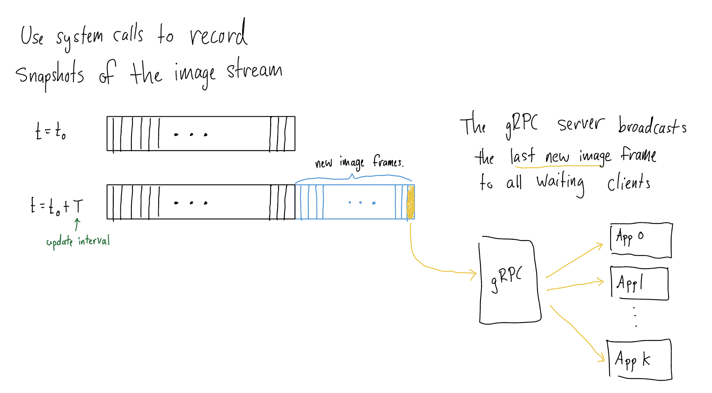

# Setup
## How to initialize your environment to run gRPC code
1. Install miniconda ([link](https://www.anaconda.com/docs/getting-started/miniconda/install))
2. Run the following commands to create the `grpc-py39` environment.
```bash
cd panoseti/grpc
conda create -n grpc-py39 python=3.9
conda activate grpc-py39
conda install -c conda-forge grpcio-tools  # get google/proto files
pip install -r requirements
```

# DaqData Service

## StreamImages RPC
Provides real-time access to movie-mode and pulse-height images during an observing run.
 
The server's `hp_io` thread compares consecutive snapshots of the current run directory to identify the last image frame for each data product.
These frames are subsequently broadcast to StreamImages clients.


## How to run the simulated DaqData server and demo visualization client
1. Navigate to daq_data/
2. Update configuration files in config/ if necessary (the default settings should work out of the box).
3. Run daq_data_server.py on a DAQ node.
4. Run demo_daq_data_client.py (You may need to set the host parameter the end of the file to the DAQ node IP address).
